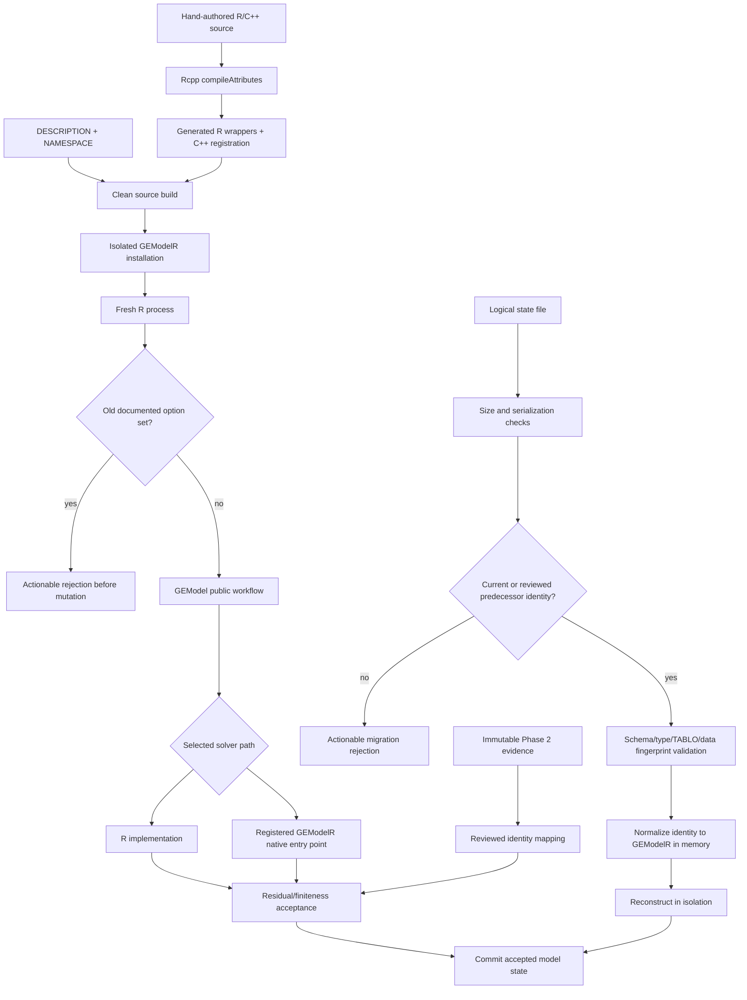

# Phase 3: GEModelR Identity Migration - Research

**Researched:** 2026-09-09
**Domain:** R package identity migration, native registration, runtime compatibility, and serialized-state lineage
**Confidence:** HIGH

<user_constraints>
## User Constraints (from CONTEXT.md)

**Source:** The following three subsections are copied verbatim from the phase context. [VERIFIED: .planning/phases/03-gemodelr-identity-migration/03-CONTEXT.md:14-41,120-126]

<!-- DATA_9F2A61C8_START -->
### Locked Decisions

### Namespace transition

- **D-01:** Use an immediate package replacement. Users remove `tabloToR`, install `GEModelR`, and update namespace-qualified calls; do not build a `tabloToR` compatibility shim. GEModelR does not inspect, uninstall, warn about, or block an independently installed old package. — **Reversibility:** costly — reversing this requires restoring the old package namespace and downstream dependency declarations.
- **D-02:** Provide exact mechanical replacements for `library(tabloToR)`, `require(tabloToR)`, `tabloToR::`, installation commands, and package dependency declarations. For `renv` projects, reinstall the renamed package and run `renv::snapshot()`; never prescribe manual `renv.lock` editing.

### Runtime options

- **D-03:** Rename every supported runtime option to the exact `GEModelR.*` prefix. If a documented `tabloToR.*` option is set, reject it at the first relevant operation before model-state mutation, identify the exact replacement, and link to `MIGRATION.md`. Do not silently ignore or temporarily honor old public keys. — **Reversibility:** costly — changing the option contract again would require another user-facing migration.
- **D-04:** Rename private fault hooks, internal transaction options, and internal error attributes directly to GEModelR identity. They receive no compatibility aliases or migration guarantee.

### Saved models

- **D-05:** Explicitly load fully validated pre-rename `gemodel-logical-state` files. Keep schema version `1L`, normalize package identity to GEModelR in memory, and write only GEModelR identity on subsequent saves. — **Reversibility:** costly — removing this support would strand logical states covered by the migration contract.
- **D-06:** Accept an old logical state only when its package source fingerprint is in a reviewed pre-rename allowlist; continue validating TABLO/model fingerprints and payload integrity. Raw `saveRDS(model)` ReferenceClass objects are not supported across the rename, and users must create a logical `saveState()` file before upgrading.

### Migration experience and identity audit

- **D-07:** Make root-level `MIGRATION.md` the authoritative guide. Add a prominent migration subsection to the README/GitHub repository landing page. Runtime migration errors show the rejected identifier, its exact GEModelR replacement, and a guide reference. A separate GitHub Pages site belongs to Phase 6.
- **D-08:** Preserve existing benchmark and baseline records as immutable pre-rename evidence. Label them historical and add a reviewed mapping from old package/source identities to the GEModelR migration baseline; never mechanically relabel past runs.
- **D-09:** Maintain a machine-readable allowlist for intentional `tabloToR` occurrences. Automated tests reject every unexpected occurrence and permit only upstream attribution, migration instructions, immutable historical evidence, old-option replacement mappings, and reviewed serialization fingerprints.

### the agent's Discretion

- Choose the implementation shape for centralized option migration checks and actionable error construction.
- Choose the machine-readable formats for the old-identity occurrence allowlist, pre-rename source-fingerprint allowlist, and benchmark identity mapping.
- Choose task boundaries and generated Rcpp regeneration commands while preserving numerical code and the Phase 2 contract.

### Deferred Ideas (OUT OF SCOPE)

- A separate `tabloToR` compatibility shim package is not part of v1.
- Automated source/lockfile rewriting and a raw-RDS converter are not part of Phase 3.
- A dedicated GitHub Pages documentation site remains Phase 6 work.
- API narrowing remains Phase 4; native portability and CI remain Phase 5; publication remains Phase 7.
<!-- DATA_9F2A61C8_END -->
</user_constraints>

<phase_requirements>
## Phase Requirements

| ID | Description | Research Support |
|----|-------------|------------------|
| COMP-04 | The rename provides explicit installation and namespace migration instructions for scripts using `tabloToR::`. | Root `MIGRATION.md`, README summary, exact source/dependency replacements, and an `renv` reinstall-then-snapshot procedure. [VERIFIED: .planning/REQUIREMENTS.md:16-20] |
| MIGR-01 | Package metadata, namespace, native initialization/registration symbols, private wrappers, options, diagnostics, benchmark signatures, tests, and documentation consistently use the GEModelR identity. | The identity inventory, native regeneration sequence, option map, historical-evidence controls, and installed-package audit below cover every named surface. [VERIFIED: .planning/REQUIREMENTS.md:27-31] |
| MIGR-02 | Package renaming does not alter solver algorithms or numerical defaults in the same change set. | The frozen-contract inventory and Phase 2 differential test strategy below make identity-only changes observable. [VERIFIED: .planning/REQUIREMENTS.md:27-32] |
</phase_requirements>

## Summary

Plan this phase as a staged identity migration with four independent gates: source identity, generated/native identity, runtime compatibility, and historical/serialized identity. The current package declares `Package: tabloToR`, loads `tabloToR`, generates `R_init_tabloToR`, and compiles eleven `_tabloToR_*` registration entries; changing only `DESCRIPTION` and R call sites would leave a mixed-identity binary. [VERIFIED: DESCRIPTION:1-4] [VERIFIED: NAMESPACE:1-3] [VERIFIED: src/RcppExports.cpp:168-185] A clean Rcpp regeneration and clean installed-package smoke test are therefore mandatory. R's native registration contract derives the initialization name from the DLL basename, and `useDynLib(..., .registration=TRUE)` binds the namespace to that registration table. [CITED: https://cran.r-project.org/doc/manuals/r-release/R-exts.html]

The most consequential planning discovery is a gap between the locked saved-state decision and the existing schema. Schema `"gemodel-logical-state"`, version `1L`, currently stores source fields `"name", "tablo_source", "tablo_fingerprint", "loaded_data", "data_fingerprint"`; it does **not** store package name or package-source fingerprint. [VERIFIED: R/modelSerialization.R:3-15,220-255,269-337] Consequently, a final GEModelR loader cannot prove that an already-created schema-1 file came from the reviewed predecessor source. Plan a pre-rename bridge wave that writes explicit predecessor package identity/source fingerprint while the package is still `tabloToR`, freeze a bridge fixture/ref, and only then perform the rename. Untagged legacy logical files must fail with an actionable bridge instruction unless the user explicitly relaxes D-06. This preserves schema version `1L` while enforcing the allowlist.

The Phase 2 evidence is strong enough to police MIGR-02: its verification reports all 25 must-haves verified and 72 tests passed, and its accepted baseline pins source fingerprint `f57c39e0bdd3020b48a602773c580a8d` with solution tolerances `atol = 1e-10`, `rtol = 1e-08`, and residual tolerance `1e-10`. [VERIFIED: .planning/phases/02-compatibility-and-numerical-baseline/02-VERIFICATION.md:6-15,40-76] [VERIFIED: tests/testthat/baselines/phase02/fingerprints.dcf:1-18] [VERIFIED: tests/testthat/baselines/phase02/ACCEPTANCE.md:3-12] Preserve those bytes as historical evidence; compare new GEModelR behavior against them through an explicit identity mapping rather than regenerating or relabeling the predecessor baseline.

**Primary recommendation:** Use a bridge-first, rename-second plan; regenerate all Rcpp bindings from hand-authored exports; centralize public old-option rejection; and make a fresh installed-package plus historical-evidence audit the phase gate.

## Architectural Responsibility Map

| Capability | Primary Tier | Secondary Tier | Rationale |
|------------|-------------|----------------|-----------|
| Package and namespace identity | R package build metadata | Installed R namespace | `DESCRIPTION` names the package and `NAMESPACE` names the DLL loaded into the namespace. [VERIFIED: DESCRIPTION:1-30] [VERIFIED: NAMESPACE:1-3] |
| Native identity and registration | Compiled C++ / DLL | Generated R wrappers | Rcpp-generated registration connects R wrapper symbols to eleven native routines and the package initialization entry point. [VERIFIED: R/RcppExports.R:1-45] [VERIFIED: src/RcppExports.cpp:168-185] |
| Runtime option migration | R API boundary | Solver backends | The first operation that consumes an option must reject the old key before mutable model state is committed. [VERIFIED: .planning/phases/03-gemodelr-identity-migration/03-CONTEXT.md:21-24] |
| Logical-state migration | Serialization boundary | ReferenceClass model state | File size/type/fingerprint validation and predecessor-lineage checks must complete before reconstructed state replaces receiver state. [VERIFIED: R/modelSerialization.R:240-337] [VERIFIED: R/GEModel.R:161-192] |
| Numerical preservation | Solver orchestration | R and C++ backends | Identity edits must leave solver defaults, algorithms, residual gates, and output contracts unchanged. [VERIFIED: R/GEModel.R:277-284] [VERIFIED: .planning/REQUIREMENTS.md:27-32] |
| Historical benchmark identity | Evidence/provenance artifacts | Benchmark harness | Historical records remain predecessor evidence; active scripts emit current GEModelR identity and map back to the accepted baseline. [VERIFIED: .planning/phases/03-gemodelr-identity-migration/03-CONTEXT.md:31-35] |
| User migration experience | Documentation and diagnostics | Runtime guardrails | `MIGRATION.md` is authoritative, README is the landing-page summary, and runtime errors carry exact replacement guidance. [VERIFIED: .planning/phases/03-gemodelr-identity-migration/03-CONTEXT.md:31-35] |

## Project Constraints (from AGENTS.md)

- Keep implementation in the existing R-package layout: focused code under `R/`, native code under `src/`, and package metadata in `DESCRIPTION`/`NAMESPACE`. [VERIFIED: AGENTS.md:5-9]
- Run `R CMD check .`, `R CMD build .`, and installed-package workflow exercises from the repository root or an isolated build directory. [VERIFIED: AGENTS.md:12-22]
- Preserve two-space indentation, base-R style with `=` assignment, camelCase functions/methods, PascalCase class-like objects, and nearby formatting; avoid unrelated reformatting. [VERIFIED: AGENTS.md:24-26]
- Add deterministic regression fixtures under `tests/testthat/`; do not commit proprietary or oversized `.tab`/`.har` inputs. [VERIFIED: AGENTS.md:28-30]
- Keep commits focused with concise present-tense subjects. [VERIFIED: AGENTS.md:32-34]
- Do not commit `.RData`, `.Rhistory`, `.Rproj.user/`, source archives, `*.Rcheck/`, credentials, private model inputs, or generated solver results. [VERIFIED: AGENTS.md:36-38]
- This research run must use `rtk`/`rtk proxy` for shell commands, preserve unrelated modified/untracked files, and modify no source or existing planning file. [VERIFIED: user phase-research request]

## Standard Stack

No new external package is needed or recommended for Phase 3. The implementation should use the dependencies and test framework already declared by the package. [VERIFIED: DESCRIPTION:31-39]

### Core

| Library/tool | Verified version | Purpose | Why standard here |
|--------------|------------------|---------|-------------------|
| R | 4.3.0 installed | Build, serialization, namespace, and package checks | The package requires `R (>= 4.0.0)` and all migration mechanisms are available in base R. [VERIFIED: DESCRIPTION:31-39] [VERIFIED: environment probe via `R --version`] |
| Rcpp | 1.1.1.1.1 installed; package metadata date 2026-04-24 | Generate R/native wrappers and registration | Existing C++ exports are Rcpp attributes; generated files must be regenerated, not hand-edited. [VERIFIED: DESCRIPTION:31-39] [VERIFIED: src/RcppExports.cpp:1-8] [CITED: https://www.rcpp.org/pdf/Rcpp-attributes.pdf] |
| Matrix | 1.6-3 installed; package metadata date 2023-11-14 | Existing default sparse backend | Matrix remains the frozen default backend; replacing it is outside this identity phase. [VERIFIED: DESCRIPTION:31-39] [VERIFIED: R/GEModel.R:277-284] |
| SparseM | 1.81 installed; package metadata date 2021-02-18 | Existing legacy sparse support | It is an existing import and must not be changed as part of MIGR-02. [VERIFIED: DESCRIPTION:31-39] |

### Supporting

| Library/tool | Verified version | Purpose | When to use |
|--------------|------------------|---------|-------------|
| testthat | 3.3.2 installed; package metadata date 2026-01-11 | Identity, serialization, differential, and installed smoke tests | Use focused filters per task and the complete suite at phase gate. [VERIFIED: DESCRIPTION:36-39] [VERIFIED: tests/testthat.R:1-4] [CITED: https://testthat.r-lib.org/reference/test_package.html] |
| base `tools` / `R CMD` | bundled with R 4.3.0 | Build, check, installation, foreign-function checks | Use clean source archive and isolated library checks to catch namespace/DLL mismatches. [CITED: https://cran.r-project.org/doc/manuals/r-release/R-exts.html] |
| DCF and CSV | base R | Reviewed identity maps and allowlists | Prefer diffable, dependency-free machine-readable artifacts for the three registries delegated to the agent. [VERIFIED: tests/testthat/baselines/phase02/fingerprints.dcf:1-18] |

### Alternatives Considered

| Instead of | Do not use | Reason |
|------------|------------|--------|
| Immediate replacement | Compatibility shim package or runtime alias | Explicitly prohibited by D-01 and deferred beyond v1. [VERIFIED: .planning/phases/03-gemodelr-identity-migration/03-CONTEXT.md:16-19,120-123] |
| Rcpp regeneration | Manual edits to `R/RcppExports.R` or `src/RcppExports.cpp` | Generated files become stale when function names/signatures change; Rcpp documents regeneration through `compileAttributes()`. [CITED: https://www.rcpp.org/pdf/Rcpp-attributes.pdf] |
| Reinstall then `renv::snapshot()` | Manual `renv.lock` editing | D-02 forbids manual lockfile editing, and renv snapshots the installed library state. [VERIFIED: .planning/phases/03-gemodelr-identity-migration/03-CONTEXT.md:16-19] [CITED: https://rstudio.github.io/renv/reference/snapshot.html] |

**Installation:** No dependency installation step. Build GEModelR from a clean source archive and install it into an isolated temporary R library during validation. [CITED: https://cran.r-project.org/doc/manuals/r-release/R-exts.html]

**Package legitimacy:** Not applicable—this phase installs no new external package. Existing dependencies are declared in `DESCRIPTION`; changing dependency identity is out of scope. [VERIFIED: DESCRIPTION:31-39]

## Architecture Patterns

### System Architecture Diagram



This flow preserves the established invariant that validation precedes mutation and adds package lineage before reconstruction. [VERIFIED: R/GEModel.R:161-192] [VERIFIED: R/modelSerialization.R:240-337]

### Recommended Project Structure

The following are proposed task targets, not claims that these files already exist:

```text
R/
├── identityMigration.R                 # centralized identity maps, option guards, error construction
├── modelSerialization.R                # package lineage validation and normalization
└── existing solver files               # consume GEModelR options; no algorithm edits
inst/migration/
├── old-identity-allowlist.csv           # exact intentional predecessor occurrences
├── predecessor-fingerprints.dcf         # reviewed logical-state lineage
└── benchmark-identity-map.dcf            # immutable predecessor → migration-baseline mapping
tools/
└── check_identity_migration.R            # source/archive/installed identity audit
tests/testthat/
├── test-identity-migration.R
└── fixtures/serialization/               # bridge-produced schema-1 predecessor state
MIGRATION.md
```

These filenames and DCF/CSV formats are implementation recommendations within the discretion granted by CONTEXT.md.

### Pattern 1: Bridge Before Rename

**What:** Add package-lineage fields to schema-1 logical-state output while the package still has predecessor identity, create a reviewed fixture/ref, and then rename the package. The final loader accepts only current identity or a predecessor fingerprint present in the reviewed allowlist. [VERIFIED: R/modelSerialization.R:3-15,220-337] [VERIFIED: .planning/phases/03-gemodelr-identity-migration/03-CONTEXT.md:26-29]

**Why:** The existing payload has the exact top-level fields below and no package-lineage field. [VERIFIED: R/modelSerialization.R:240-255]

<!-- DATA_0B6E873A_START -->
```r
c("schema", "schema_version", "source", "engine", "levels", "closure",
  "shocks", "accepted", "memory_budget", "diagnostics")
c("name", "tablo_source", "tablo_fingerprint", "loaded_data", "data_fingerprint")
```
<!-- DATA_0B6E873A_END -->

The bridge must keep the exact schema identity `"gemodel-logical-state"` and version `1L`; those values are locked. [VERIFIED: R/modelSerialization.R:3-15] Untagged old files cannot satisfy D-06 and must not be silently treated as if they carried the accepted fingerprint.

### Pattern 2: Rename Hand-authored Native Exports, Then Regenerate

**What:** Rename the hand-authored `// [[Rcpp::export]]` function/class identities and their R call sites first; update package metadata; remove only the two generated export files; run `Rcpp::compileAttributes(".")`; then inspect the generated registration table and built DLL. [VERIFIED: src/dense-schur.cpp:43-115] [VERIFIED: src/sparse-elimination.cpp:212-383] [VERIFIED: src/sparse-lu.cpp:13-68] [VERIFIED: src/sparse-schur.cpp:155-268] [VERIFIED: src/sparse-schur-openmp.cpp:149-150] [CITED: https://www.rcpp.org/pdf/Rcpp-attributes.pdf]

**Verification target:** The predecessor table currently contains the exact initializer `R_init_tabloToR` and these eleven registered strings, all of which must be replaced in the generated output. [VERIFIED: src/RcppExports.cpp:168-185]

<!-- DATA_6D38A259_START -->
```text
_tabloToR_tabloToR_dense_lu_factor
_tabloToR_tabloToR_dense_lu_solve
_tabloToR_tabloToR_dense_lu_release
_tabloToR_tabloToR_eliminate_blocks
_tabloToR_tabloToR_reconstruct_blocks
_tabloToR_tabloToR_schur_cpp_capabilities
_tabloToR_tabloToR_sparse_lu_solve
_tabloToR_tabloToR_sparse_pattern_hash
_tabloToR_tabloToR_schur_accumulate_batch_parallel
_tabloToR_tabloToR_schur_accumulate_global
_tabloToR_tabloToR_schur_accumulate_batch
R_init_tabloToR
```
<!-- DATA_6D38A259_END -->

Rcpp's FAQ specifically warns that stale generated wrappers can retain obsolete registrations; regenerate both files together, and repeat regeneration if the first pass changes generated declarations. [CITED: https://www.rcpp.org/pdf/Rcpp-FAQ.pdf]

### Pattern 3: Centralized Public Option Migration With Local Consumption Gates

**What:** Keep one exact predecessor-to-successor map and one error constructor, but invoke it at the first operation that would consume each option. Detect presence using `old_key %in% names(options())`, because base R documents that `getOption()` returning `NULL` cannot distinguish unset from explicitly set-to-`NULL`. [CITED: https://www.stat.ethz.ch/R-manual/R-devel/library/base/html/options.html]

The supported migration set should be the options documented in README/SERIALIZATION plus the production diagnostic that instructs users to set sparse LU ordering. The exact predecessor keys are: [VERIFIED: README.md:176-209] [VERIFIED: inst/compatibility/SERIALIZATION.md:51-57] [VERIFIED: R/sparseSolver.R:1436-1450]

<!-- DATA_D8E30F74_START -->
```text
tabloToR.serialization.max_bytes
tabloToR.serialization.max_elements
tabloToR.sparse.lu_order
tabloToR.sparse.schur_cpp_threads
tabloToR.sparse.schur_max_iterations
tabloToR.sparse.schur_panel_size
tabloToR.sparse.schur_refinement_iterations
tabloToR.sparse.schur_region_batch_size
tabloToR.sparse.schur_restart
tabloToR.sparse.schur_tolerance
tabloToR.sparse.structured_residual_tolerance
tabloToR.sparse.suite_sparse_ordering
```
<!-- DATA_D8E30F74_END -->

Each successor is the same suffix under exact prefix `GEModelR.*`, as locked by D-03. Serialization guards run before file I/O or receiver mutation; backend-specific guards run only when that backend/operation becomes relevant. Private hooks and internal attributes are direct renames with no old-key lookup. [VERIFIED: .planning/phases/03-gemodelr-identity-migration/03-CONTEXT.md:21-24]

The private/internal predecessor keys found in source are shown verbatim below; rename them directly and do not include them in the public migration alias map. [VERIFIED: R/GEModel.R:74-119,161-192] [VERIFIED: R/modelSerialization.R:3-15] [VERIFIED: R/sparseElimination.R:477-483] [VERIFIED: R/sparseSchurComplement.R:207-211,454-677] [VERIFIED: R/zzzSparseSchurCpp.R:591-591]

<!-- DATA_C1537B90_START -->
```text
tabloToR.accepted_numerical_state
tabloToR.legacy.transaction.working
tabloToR.phase02.acceptance.fault
tabloToR.sparse.elimination_pivot_tolerance
tabloToR.sparse.schur_progress
tabloToR.sparse.schur_true_residual_frequency
tabloToR.sparse.schur_validation_chunk_size
tabloToR.sparse.sum_vectorized_limit
tabloToR.sparse.vectorized
tabloToR.transaction.fault
```
<!-- DATA_C1537B90_END -->

### Pattern 4: Exact Identity Allowlist, Not Directory Exclusions

**What:** Scan tracked path names and text case-insensitively for `tabloToR`/`TABLOTOR`, then scan the built archive and isolated installation. Permit only exact reviewed records in the five D-09 categories. [VERIFIED: .planning/phases/03-gemodelr-identity-migration/03-CONTEXT.md:31-35]

Use exact path, category, expected occurrence count, matched literal/line digest, whole-file digest for immutable evidence, and rationale. Do not allowlist directories or globs: that would permit future stale identity occurrences without review.

The current tracked tree contains 618 matching lines across 131 files, so this must be an inventory-driven task rather than an ad hoc replacement. [VERIFIED: repository `git grep -n -I -i tabloToR` audit on 2026-09-09] Generic `tablo` identifiers refer to the model language and are not old package identity; the audit target is the package token, not every occurrence of “TABLO”. [VERIFIED: README.md:1-40]

### Pattern 5: Historical Evidence Is Immutable; Active Producers Migrate

**What:** Keep accepted Phase 2 baseline files and past benchmark outputs byte-identical, categorize them as immutable historical evidence, and add a reviewed map from predecessor identities to the GEModelR migration baseline. Active benchmark scripts, package signatures, diagnostics, and tests must emit/use GEModelR. [VERIFIED: .planning/phases/03-gemodelr-identity-migration/03-CONTEXT.md:31-35]

The accepted predecessor identity values are quoted exactly below. [VERIFIED: tests/testthat/baselines/phase02/fingerprints.dcf:1-18] [VERIFIED: tests/testthat/baselines/phase02/ACCEPTANCE.md:3-12]

<!-- DATA_64C7B192_START -->
```text
Schema: phase02-baseline-v1
Source-Fingerprint: f57c39e0bdd3020b48a602773c580a8d
Package-Name: tabloToR
Package-Version: 0.1.0
Package-Signature: e21e8704cc3888c0b7c489200a4d9fb8
Proposal-Fingerprint: f6f229608c4aa6a186534007cf33e71c
Solution-Atol: 1e-10
Solution-Rtol: 1e-08
Residual-Tolerance: 1e-10
```
<!-- DATA_64C7B192_END -->

Do not rerun the predecessor acceptance updater after identity changes, because package/source signatures intentionally change. Instead, test solver outputs and diagnostics against the accepted numerical expectations while mapping the identity-bearing fields.

### Pattern 6: Fresh-process Installed-package Verification

**What:** Build from a clean copy into a temporary output directory, install to a temporary library, and launch a new `Rscript --vanilla` process. Assert package metadata, namespace name, DLL basename, registration names, public workflow, and absence of old loaded identity. [CITED: https://cran.r-project.org/doc/manuals/r-release/R-exts.html]

Do not assert that `tabloToR` is absent from all user libraries: D-01 explicitly permits an independently installed predecessor. On this machine `tabloToR` 0.1.0 is installed at `/home/zenz/R/x86_64-pc-linux-gnu-library/4.3/tabloToR` and `GEModelR` is not installed; validation must isolate `.libPaths()` instead of modifying that installation. [VERIFIED: local `Rscript --vanilla` environment audit on 2026-09-09]

### Anti-Patterns to Avoid

- **Global search-and-replace:** It would rewrite immutable historical evidence, upstream attribution, and migration examples that are required to retain predecessor identity. [VERIFIED: .planning/phases/03-gemodelr-identity-migration/03-CONTEXT.md:31-35]
- **Editing generated Rcpp files by hand:** It risks stale registration and mismatched wrapper arity. Rename hand-authored exports, regenerate, and inspect generated outputs. [CITED: https://www.rcpp.org/pdf/Rcpp-attributes.pdf]
- **Treating source grep as proof of installed identity:** Stale `.o`, `.so`, `symbols.rds`, archive, check, or installed-library artifacts can retain old symbols after source edits. [VERIFIED: runtime inventory below]
- **Accepting schema-1 files solely because the schema matches:** The current schema lacks package lineage, so schema/version alone cannot satisfy the reviewed-source requirement. [VERIFIED: R/modelSerialization.R:3-15,220-337]
- **Renaming `exportPattern()` in this phase:** API narrowing is explicitly Phase 4; retain the current broad export policy while updating identity-bearing wrapper names and the compatibility manifest. [VERIFIED: NAMESPACE:1-3] [VERIFIED: .planning/phases/03-gemodelr-identity-migration/03-CONTEXT.md:120-126]
- **Changing algorithms/defaults while touching option call sites:** Keep identity edits separate from solver logic and use the Phase 2 oracle after each wave. [VERIFIED: .planning/REQUIREMENTS.md:27-32]
- **Manual `renv.lock` surgery:** Reinstall GEModelR and snapshot the resulting library. [VERIFIED: .planning/phases/03-gemodelr-identity-migration/03-CONTEXT.md:16-19] [CITED: https://rstudio.github.io/renv/articles/faq.html]

## Don't Hand-Roll

| Problem | Don't build | Use instead | Why |
|---------|-------------|-------------|-----|
| R/native binding generation | Custom `.Call` wrapper generator | `Rcpp::compileAttributes()` | It updates both R wrappers and the C++ registration initializer from attributes. [CITED: https://www.rcpp.org/pdf/Rcpp-attributes.pdf] |
| Package build/namespace validation | Grep-only release checker | `R CMD build`, `R CMD check`, isolated `R CMD INSTALL`, `tools::checkFF()` | R's checks exercise loadability, registration, foreign calls, and installed metadata. [CITED: https://cran.r-project.org/doc/manuals/r-release/R-exts.html] |
| Serialized object codec | Custom binary format | Existing `saveRDS()`/`readRDS()` plus strict schema validation | D-05 freezes logical-state schema version `1L`; redesign is out of scope. [VERIFIED: R/modelSerialization.R:3-15] [CITED: https://stat.ethz.ch/R-manual/R-devel/library/base/html/readRDS.html] |
| Dependency lockfile rewrite | Text replacement in `renv.lock` | Install GEModelR, then `renv::snapshot()` | Snapshot records the installed project-library state and avoids invalid manual metadata. [CITED: https://rstudio.github.io/renv/reference/snapshot.html] |
| Compatibility namespace | Alias/shim package | Exact migration guide and fail-fast errors | A shim is prohibited by D-01. [VERIFIED: .planning/phases/03-gemodelr-identity-migration/03-CONTEXT.md:16-19] |
| Historical evidence rewrite | Recomputed predecessor baseline | Immutable baseline plus explicit identity map | Rewriting would falsely attribute old runs to a new package identity. [VERIFIED: .planning/phases/03-gemodelr-identity-migration/03-CONTEXT.md:31-35] |

**Key insight:** Identity migration is a consistency and lineage problem, not a string-replacement problem. Standard R build/registration machinery should generate executable identity, while small reviewed data maps govern intentional predecessor references.

## Runtime State Inventory

The canonical rename question—what retains `tabloToR` after every tracked source file is updated—was checked across all five required categories.

| Category | Items Found | Action Required |
|----------|-------------|-----------------|
| Stored data | No committed user logical-state fixture was found. Repository-local RDS-like state is limited to generated/check metadata such as `src/symbols.rds`; user-held `.rds` files outside the repository are not enumerable. [VERIFIED: repository file inventory on 2026-09-09] | Add bridge-produced predecessor fixtures and migration preflight. Existing untagged external states need the bridge workflow; do not infer lineage. Remove/rebuild generated `symbols.rds` during clean validation. |
| Live service config | Git remote `origin` is `ssh://git@ssh.github.com:443/DavidZenz/tabloToR.git`; package metadata already points at the GEModelR GitHub repository. No other live service configuration is part of this local R-package phase. [VERIFIED: local `git remote -v` audit on 2026-09-09] [VERIFIED: DESCRIPTION:13-14] | Do not mutate the remote in Phase 3; publication/external repository coordination belongs to Phase 7. Keep predecessor remote text only where categorized as upstream attribution or historical evidence. |
| OS-registered state | No user systemd unit or crontab entry containing the old identity was found; `pm2` is unavailable. [VERIFIED: local `systemctl --user`, `crontab -l`, and `command -v pm2` audit on 2026-09-09] | None. Re-run a lightweight audit in execution; no re-registration task is currently required. |
| Secrets/env vars | No environment variable name containing `tabloToR` or `GEModelR` was found; secret values were not read. No documented runtime identity contract uses environment variables. [VERIFIED: local environment-name audit on 2026-09-09] [VERIFIED: README.md:1-220] | None. Do not inspect or rewrite secret values; option migration is through R options, not environment keys. |
| Build artifacts / installed packages | Old-identity artifacts exist: `src/*.o`, `src/tabloToR.so`, `src/symbols.rds`, `tabloToR_0.1.0.tar.gz`, `..Rcheck/tabloToR`, `tabloToR.Rcheck/`, and an installed `tabloToR` 0.1.0. The current DLL exports `R_init_tabloToR` and old `_tabloToR_*` entry points. [VERIFIED: local filesystem, installed-library, and `nm -D` audit on 2026-09-09] | Build from a clean temporary source tree and isolated library. Do not uninstall the independent old package. Assert no old identity in the new archive/install/DLL; leave unrelated user artifacts untouched. |

## Common Pitfalls

### Pitfall 1: Strict Predecessor Allowlist Without Recorded Lineage

**What goes wrong:** The final loader either rejects every real predecessor file or silently assigns an accepted fingerprint to files that never carried one.

**Why it happens:** The current schema-1 payload records TABLO/data fingerprints but no package-source fingerprint. [VERIFIED: R/modelSerialization.R:220-337]

**How to avoid:** Make a pre-rename bridge wave a hard dependency of the rename wave; produce a tagged fixture and reviewed predecessor reference before changing `Package:`.

**Warning signs:** Tests fabricate old identity by editing a new payload, or the loader has a fallback equivalent to “missing package fingerprint means accepted predecessor.”

### Pitfall 2: Mixed DLL and Namespace Identity

**What goes wrong:** Source appears renamed but package load or `.Call` fails because `useDynLib`, `R_init_*`, generated symbols, wrapper `PACKAGE=`, or the DLL basename disagree.

**Why it happens:** Rcpp registration spans hand-authored attributes, two generated files, `NAMESPACE`, and the built shared object. [VERIFIED: NAMESPACE:1-3] [VERIFIED: R/RcppExports.R:1-45] [VERIFIED: src/RcppExports.cpp:168-185]

**How to avoid:** Regenerate both export files, clean artifacts, build/install in isolation, and inspect registered routines in a fresh process.

**Warning signs:** `R_init_tabloToR`, `_tabloToR_`, `PACKAGE = "tabloToR"`, or `tabloToR.so` appears in the new archive/install.

### Pitfall 3: Broad Export Policy Accidentally Changes API

**What goes wrong:** Renaming generated wrappers changes the compatibility manifest or prompts premature export cleanup.

**Why it happens:** `NAMESPACE` still uses the exact broad rule `exportPattern("^[[:alpha:]]+")`, and generated wrappers such as `tabloToR_eliminate_blocks` are therefore observable despite being classified internal. [VERIFIED: NAMESPACE:1-3] [VERIFIED: R/RcppExports.R:15-22] [VERIFIED: inst/compatibility/GEModel-contract.csv:1-80]

**How to avoid:** Rename identity-bearing manifest rows mechanically but preserve export count/tier and defer export narrowing to Phase 4.

**Warning signs:** Unrelated exports disappear, wrapper arities change, or `NAMESPACE` stops using the existing export policy.

### Pitfall 4: Old Option Is Detected Too Early or Too Late

**What goes wrong:** Package load fails for an irrelevant backend option, or model state mutates before an old key is rejected.

**Why it happens:** A global startup scan violates “first relevant operation,” while scattered custom checks make timing inconsistent.

**How to avoid:** Centralize map/error construction and call guards at serialization/backend operation boundaries before I/O or state commit. [VERIFIED: .planning/phases/03-gemodelr-identity-migration/03-CONTEXT.md:21-24]

**Warning signs:** `.onLoad()` checks all options, old keys are silently ignored, or a transaction begins before the guard.

### Pitfall 5: Historical Baseline Is Regenerated After Rename

**What goes wrong:** A pre-rename run is relabeled as GEModelR, destroying provenance and making numerical changes harder to distinguish from intended identity changes.

**Why it happens:** Existing refresh tooling includes package/source identity in its fingerprint input. [VERIFIED: inst/tools/refresh_phase02_baselines.R:192-229,325-378]

**How to avoid:** Freeze Phase 2 bytes and map intentional identity differences. Add a test that records baseline file digests before implementation and fails if they change.

**Warning signs:** `fingerprints.dcf` or `ACCEPTANCE.md` changes in an identity commit, or accepted predecessor hashes disappear.

### Pitfall 6: Dirty-tree Validation Passes Against Stale Native Objects

**What goes wrong:** Tests load `src/tabloToR.so` or stale object code and report results unrelated to the renamed source.

**Why it happens:** Compiled artifacts already exist in the worktree and local installed library. [VERIFIED: runtime inventory above]

**How to avoid:** Copy tracked source into a temporary clean build root, run build/check/install there, and isolate `.libPaths()`.

**Warning signs:** validation paths point into the working `src/`, existing user library, `..Rcheck`, or old source archive.

## Code Examples

Verified patterns from official sources and the current contract:

### Registered Native Library

```r
# NAMESPACE target. Package name is locked by D-01; registration pattern is
# documented by Writing R Extensions.
useDynLib(GEModelR, .registration = TRUE)
```

R looks for an initialization function based on the shared-library basename, so the generated target is `R_init_GEModelR`; dynamic symbols should remain disabled by generated registration. [CITED: https://cran.r-project.org/doc/manuals/r-release/R-exts.html]

### Operation-local Old-option Guard

```r
# Proposed internal pattern; exact option values are quoted in Pattern 3.
assertNoLegacyOption = function(oldKey, newKey) {
  if (oldKey %in% names(options())) {
    stop(
      sprintf(
        "Unsupported option '%s'; use '%s'. See MIGRATION.md.",
        oldKey,
        newKey
      ),
      call. = FALSE
    )
  }
}
```

Presence is checked through `names(options())`, not the value returned by `getOption()`. [CITED: https://www.stat.ethz.ch/R-manual/R-devel/library/base/html/options.html]

### Logical-state Lineage Branch

```r
# Proposed validation order; field names are recommendations within agent discretion.
validatePackageLineage = function(identity, currentName, allowedPredecessors) {
  if (identical(identity$name, currentName)) return("current")
  key = identity$source_fingerprint
  if (!is.character(key) || length(key) != 1L || !key %in% allowedPredecessors) {
    stop("Unsupported saved-state package lineage; see MIGRATION.md.", call. = FALSE)
  }
  "predecessor"
}
```

Run this only after bounded RDS decode and structural type checks, and before receiver mutation. The current maximums are exactly `256 * 1024^2` bytes and `50000000` elements; preserve them. [VERIFIED: R/modelSerialization.R:3-15]

### Clean Rcpp Regeneration

```r
# Run after hand-authored C++ export names and DESCRIPTION are changed.
Rcpp::compileAttributes(".")
```

The official Rcpp attributes documentation identifies `R/RcppExports.R` and `src/RcppExports.cpp` as generated outputs and requires regeneration after exported names/signatures change. [CITED: https://www.rcpp.org/pdf/Rcpp-attributes.pdf]

## Frozen Identity-adjacent Contract

The planner should put these exact values in a “must remain byte/behavior equivalent” checklist rather than relying only on broad test-suite success.

### Public solver signature

<!-- DATA_02F4ACD1_START -->
```r
solveModel(iter = 3, steps = c(1, 3), engine = c("legacy", "sparse"),
           postsim = TRUE, diagnostics = FALSE,
           output = c("full", "compact"), variables = NULL,
           dimensions = NULL, backend = "Matrix",
           reduction = c("auto", "off", "on"), memory_budget = NULL)
```
<!-- DATA_02F4ACD1_END -->

[VERIFIED: R/GEModel.R:277-284]

### Structured-solver defaults

<!-- DATA_1A6CBF04_START -->
```text
region_batch_size = 8L
panel_size = 64L
restart = 80L
max_iterations = 500L
tolerance = 2e-7
true_residual_frequency = 1L
structured_residual_tolerance = 2e-7
elimination_pivot_tolerance = 1e-12
sparse.lu_order = 3
```
<!-- DATA_1A6CBF04_END -->

[VERIFIED: R/sparseElimination.R:477-483] [VERIFIED: R/sparseSolver.R:1436-1456,2151-2207]

## State of the Art

| Old approach | Current/recommended approach | Source | Impact on this phase |
|--------------|------------------------------|--------|----------------------|
| Hand-maintained or stale Rcpp wrappers | Attribute-driven regeneration of both wrapper files and package initializer | [CITED: https://www.rcpp.org/pdf/Rcpp-attributes.pdf] | Rename hand-authored identities and regenerate as one atomic task. |
| Dynamic lookup or unchecked foreign calls | Registered routines with `.registration=TRUE` and dynamic symbols disabled | [CITED: https://cran.r-project.org/doc/manuals/r-release/R-exts.html] | Inspect registration table and fresh DLL, not only R source. |
| Manual lockfile replacement | Install changed package, then snapshot project library | [CITED: https://rstudio.github.io/renv/reference/snapshot.html] | Migration docs give executable reinstall/snapshot steps. |
| Treat RDS as self-describing trusted lineage | Explicit schema/type/size/fingerprint allowlists with trusted-local scope | [CITED: https://stat.ethz.ch/R-manual/R-devel/library/base/html/readRDS.html] [VERIFIED: inst/compatibility/SERIALIZATION.md:21-49] | Add package lineage without weakening existing validation. |
| OWASP ASVS 4.x section labels | ASVS 5.0.0 stable release reorganizes controls; safe deserialization is 1.5.2 | [CITED: https://github.com/OWASP/ASVS] [CITED: https://github.com/OWASP/ASVS/blob/master/5.0/en/0x10-V1-Encoding-and-Sanitization.md] | Security validation should cite the current deserialization control rather than infer web-auth controls for a local R package. |

**Deprecated/outdated:** Manual edits to generated `RcppExports` files and manual `renv.lock` package-name replacement are not acceptable migration procedures. [CITED: https://www.rcpp.org/pdf/Rcpp-attributes.pdf] [CITED: https://rstudio.github.io/renv/articles/faq.html]

## Assumptions Log

| # | Claim | Section | Risk if Wrong |
|---|-------|---------|---------------|
| A1 | Proposed filenames and DCF/CSV layouts are suitable implementation choices. [ASSUMED] | Recommended Project Structure | Low; CONTEXT delegates format choice, and the planner may rename files without changing behavior. |
| A2 | A reviewed pre-rename bridge commit/ref can be made available to users who need to create a lineage-tagged logical state. [ASSUMED] | Pattern 1 / Open Questions | High; without a reachable bridge, strict D-06 support cannot cover existing untagged schema-1 files. |
| A3 | Exact-path/count/digest allowlist records are maintainable at the current repository size. [ASSUMED] | Pattern 4 | Medium; if review burden is excessive, the format may change, but broad directory exclusions must still be avoided. |

## Open Questions

1. **RESOLVED — How will users obtain the pre-rename bridge?**
   - Resolution: Before `Package:` changes, a blocking human checkpoint must verify that an already-authorized, immutable predecessor commit-addressed ref or content-addressed archive is objectively reachable by users. The gate must reproduce the recorded package/source/fixture fingerprints and present exact, placeholder-free installation and raw-RDS-to-`saveState()` conversion commands. It fails closed when the locator, reachability, fingerprints, commands, or approval are absent or mismatched; an untagged state is never inferred or normalized.

2. **RESOLVED — Is renaming the external GitHub repository/remotes part of this phase?**
   - Resolution: No. Remote mutation and publication are deferred and not authorized in Phase 3. Plans may perform read-only reachability checks against an already-authorized ref/archive, but must not push, tag, upload, rename remotes, change repository settings, or publish.

3. **RESOLVED — What is the full-check acceptance policy?**
   - Resolution: `R CMD check` must finish with zero ERRORs and zero WARNINGs. NOTES are acceptable only when each is captured verbatim, reviewed, documented with its cause and disposition, and shown not to hide identity, numerical, serialization, native-registration, archive, or installed-workflow failure. An unresolved high-severity finding blocks completion.


| Dependency | Required By | Available | Version | Fallback |
|------------|-------------|-----------|---------|----------|
| R | build/test/install | ✓ | 4.3.0 | None needed. [VERIFIED: local environment probe] |
| Rcpp | wrapper regeneration | ✓ | 1.1.1.1.1 | None; required existing dependency. [VERIFIED: local installed-package probe] |
| testthat | regression suite | ✓ | 3.3.2 | Base smoke script only if framework breaks, but testthat is present. [VERIFIED: local installed-package probe] |
| Matrix | default sparse path | ✓ | 1.6-3 | No fallback in this phase; default is frozen. [VERIFIED: local installed-package probe] |
| SparseM | legacy sparse support | ✓ | 1.81 | No dependency change in this phase. [VERIFIED: local installed-package probe] |
| `nm` | native symbol audit | ✓ | GNU nm 2.31.1 | R registered-routine inspection on platforms without `nm`. [VERIFIED: local environment probe] |
| Git | clean-source and historical-byte audit | ✓ | 2.55.0 | Explicit file manifests/digests if unavailable. [VERIFIED: local environment probe] |
| tar | source archive inspection | ✓ | 1.30 | R archive tooling. [VERIFIED: local environment probe] |
| Context7 | curated documentation lookup | ✗ | — | Official R/Rcpp/testthat/renv documentation was used. [VERIFIED: local tool availability audit] |

**Missing dependencies with no fallback:** None. [VERIFIED: environment audit]

**Missing dependencies with fallback:** Context7 is unavailable; official primary documentation supplied the needed API/build facts. [VERIFIED: research-provider audit]

## Validation Architecture

### Baseline Status

The pre-rename oracle is currently usable: `tools/refresh_phase02_baselines.R --check` returned “No stable baseline changes,” and a focused testthat run covering compatibility, numerical baseline, model serialization, public solver contract, and public C++ backend completed successfully on 2026-09-09. [VERIFIED: local validation run on 2026-09-09] Phase 2's accepted verification remains the authority for the frozen numerical contract. [VERIFIED: .planning/phases/02-compatibility-and-numerical-baseline/02-VERIFICATION.md:6-76]

### Test Framework

| Property | Value |
|----------|-------|
| Framework | testthat 3.3.2, edition 3 [VERIFIED: tests/testthat.R:1-4] [VERIFIED: DESCRIPTION:36-39] |
| Config file | `tests/testthat.R`; no separate testthat config required. [VERIFIED: tests/testthat.R:1-4] |
| Quick run command | `rtk proxy Rscript --vanilla -e 'testthat::test_local(filter="identity-migration|model-serialization|public-solver-contract", reporter="summary")'` |
| Baseline quick command | `rtk proxy Rscript --vanilla tools/refresh_phase02_baselines.R --check` |
| Full suite command | `rtk proxy Rscript --vanilla -e 'testthat::test_local(reporter="summary")'` |
| Package gate | Clean temporary source copy: `R CMD build`, `R CMD check`, isolated `R CMD INSTALL`, then fresh-process smoke. [CITED: https://cran.r-project.org/doc/manuals/r-release/R-exts.html] |

### Phase Requirements → Test Map

| Req ID | Behavior | Test Type | Automated Command | File Exists? |
|--------|----------|-----------|-------------------|-------------|
| COMP-04 | Migration guide contains exact library/require/`::`/dependency/install/renv replacements, and README links prominently to it. | documentation contract | `rtk proxy Rscript --vanilla -e 'testthat::test_local(filter="identity-migration", reporter="summary")'` | ❌ Wave 0: `tests/testthat/test-identity-migration.R` |
| MIGR-01 | Source, archive, installed package, DLL, options, diagnostics, active benchmarks, tests, and current docs use GEModelR; only categorized predecessor occurrences remain. | integration + installed smoke | `rtk proxy Rscript --vanilla tools/check_identity_migration.R` | ❌ Wave 0: audit tool and test |
| MIGR-01 | Reviewed predecessor state loads, normalizes in memory, and re-saves current identity; unreviewed/untagged state fails without receiver mutation. | serialization integration | `rtk proxy Rscript --vanilla -e 'testthat::test_local(filter="model-serialization|identity-migration", reporter="summary")'` | ⚠️ Existing serialization tests; bridge fixture and lineage cases are Wave 0 gaps. [VERIFIED: tests/testthat/test-model-serialization.R:1-408] |
| MIGR-02 | Public signatures, option defaults, solver outputs, residuals, diagnostics, and accepted Phase 2 evidence remain unchanged except mapped identity fields. | differential regression | `rtk proxy Rscript --vanilla tools/refresh_phase02_baselines.R --check` | ✅ Existing baseline checker; add immutable-evidence digest assertion. [VERIFIED: inst/tools/refresh_phase02_baselines.R:1-420] |

### Required Test Layers

1. **Static source identity audit:** Scan tracked path names and content. Verify every old hit has an exact reviewed allowlist record and every record still matches its count/digest/category. Reject unused/stale allowlist entries as well as unexpected hits.
2. **Generated/native audit:** Assert `R/RcppExports.R`, `src/RcppExports.cpp`, `NAMESPACE`, and the built shared object use GEModelR registration; enumerate registered `.Call` routines and verify all eleven expected replacements and arities. [VERIFIED: R/zzzSparseSchurCpp.R:11-59] [VERIFIED: src/RcppExports.cpp:168-185]
3. **Option table tests:** For each of the twelve supported predecessor keys, set only that key, invoke the first relevant operation, and assert pre-mutation error text contains old key, exact new key, and `MIGRATION.md`. Separately assert each private key is directly renamed and has no compatibility path. [VERIFIED: option inventories in Pattern 3]
4. **Serialization lineage matrix:** Test current state, allowlisted predecessor bridge state, unknown predecessor fingerprint, missing lineage, malformed lineage types/lengths, altered TABLO/data fingerprints, oversized file, disallowed payload object, and receiver nonmutation after every failure. [VERIFIED: R/modelSerialization.R:3-15,240-337] [CITED: https://github.com/OWASP/ASVS/blob/master/5.0/en/0x10-V1-Encoding-and-Sanitization.md]
5. **Historical immutability:** Assert accepted Phase 2 files retain their pre-plan digests and predecessor labels; separately validate the benchmark identity map and current GEModelR producer metadata. [VERIFIED: tests/testthat/baselines/phase02/fingerprints.dcf:1-18]
6. **Fresh installed package:** In an isolated library/new process, load only GEModelR and run the documented `GEModel$new()`, `loadTablo()`, `loadData()`, closure/shock, and `solveModel()` smoke path with redistributable fixtures. Verify package/DLL/registration identity and absence of old loaded namespace/DLL. [VERIFIED: .planning/REQUIREMENTS.md:16-31] [CITED: https://cran.r-project.org/doc/manuals/r-release/R-exts.html]

### Sampling Rate

- **Per task commit:** Run the quick identity/serialization/contract filter plus `tools/refresh_phase02_baselines.R --check`.
- **After native regeneration tasks:** Also run generated/native registration inspection in a fresh process.
- **Per wave merge:** Run the full testthat suite.
- **Phase gate:** Run clean `R CMD build`, `R CMD check`, isolated install/fresh-process workflow, source/archive/install identity audits, and Phase 2 baseline check. Full gate must introduce no new failures; any known deferred benchmark portability exception must be named and matched to Phase 2 verification. [VERIFIED: AGENTS.md:12-22] [VERIFIED: .planning/phases/02-compatibility-and-numerical-baseline/02-VERIFICATION.md:77-104]

### Wave 0 Gaps

- [ ] `tests/testthat/test-identity-migration.R` — source/docs/options/native/installed identity contract for COMP-04 and MIGR-01.
- [ ] Bridge-generated predecessor logical-state fixture — required to prove D-05/D-06 without fabricating lineage after the rename.
- [ ] Serialization lineage cases in `tests/testthat/test-model-serialization.R` — current, allowlisted predecessor, missing, malformed, and unknown identities with receiver nonmutation.
- [ ] `tools/check_identity_migration.R` — reusable scan of tracked source, source archive, installed package, loaded namespace/DLL, and registration table.
- [ ] Immutable Phase 2 file digest snapshot/check — prevents accidental relabeling while active producers change.
- [ ] Machine-readable option replacement map tests — enforce exact old/new pairs and error timing.

### 03-VALIDATION.md Planning Notes

Define validation milestones by wave, not only at phase end: (1) bridge artifact and lineage-negative tests green under predecessor identity; (2) metadata/options/docs rename with source audit green; (3) Rcpp regeneration and clean installed-native smoke green; (4) benchmark/history map and complete baseline/full-check gate green. Do not permit the rename wave to start until the bridge fixture/ref and old baseline digests are frozen.

## Security Domain

Security enforcement is enabled because `.planning/config.json` does not set `security_enforcement` to `false`. [VERIFIED: .planning/config.json:1-43]

### Applicable ASVS Categories

The output template uses ASVS 4.x category names; ASVS 5.0.0 is the current stable release and reorganizes these controls. The relevant control for this local package is safe deserialization, not web authentication/session management. [CITED: https://github.com/OWASP/ASVS]

| ASVS Category | Applies | Standard Control |
|---------------|---------|-----------------|
| V2 Authentication | no | No authentication boundary exists in this local R package. [VERIFIED: DESCRIPTION:1-39] |
| V3 Session Management | no | No web/session mechanism exists. [VERIFIED: DESCRIPTION:1-39] |
| V4 Access Control | no | The package does not implement authorization roles or protected resources. [VERIFIED: R/GEModel.R:1-320] |
| V5 Input Validation | yes | Preserve size bounds, exact schema/list/type checks, reviewed identity allowlist, TABLO/data fingerprints, and isolated reconstruction. [VERIFIED: R/modelSerialization.R:3-15,240-337] |
| V6 Cryptography | no | Existing MD5 values are explicitly change-detection fingerprints, not authentication or tamper-proof signatures. [VERIFIED: inst/compatibility/SERIALIZATION.md:45-49] |
| ASVS 5.0.0 1.5.2 Safe deserialization | yes | Restrict deserialized object types/classes and validate package/source identity before use. [CITED: https://github.com/OWASP/ASVS/blob/master/5.0/en/0x10-V1-Encoding-and-Sanitization.md] |

### Known Threat Patterns for R Serialization and Native Identity

| Pattern | STRIDE | Standard Mitigation |
|---------|--------|---------------------|
| Malformed or hostile RDS payload | Tampering | Keep the documented trusted-local boundary, pre-decode file-size limit, post-decode element/type allowlists, exact schema, fingerprint checks, and isolated reconstruction. `readRDS()` decodes before package-level validation, so documentation must not claim arbitrary untrusted files are safe. [VERIFIED: inst/compatibility/SERIALIZATION.md:21-49] [CITED: https://stat.ethz.ch/R-manual/R-devel/library/base/html/readRDS.html] |
| Forged predecessor fingerprint | Spoofing | Treat the allowlist as compatibility lineage, not cryptographic authenticity; accept only exact scalar values in reviewed data and retain all content fingerprints. [VERIFIED: inst/compatibility/SERIALIZATION.md:45-49] |
| Environment/function/external-pointer injection in payload | Tampering / Elevation of privilege | Reject unsupported object types/classes before reconstruction and never evaluate payload language objects. [VERIFIED: R/modelSerialization.R:269-337] [CITED: https://github.com/OWASP/ASVS/blob/master/5.0/en/0x10-V1-Encoding-and-Sanitization.md] |
| Native symbol confusion or unintended dynamic lookup | Tampering | Generated registration table, `.registration=TRUE`, `R_useDynamicSymbols(dll, FALSE)`, clean DLL inspection, and fresh-process registered-routine tests. [VERIFIED: NAMESPACE:1-3] [VERIFIED: src/RcppExports.cpp:168-185] [CITED: https://cran.r-project.org/doc/manuals/r-release/R-exts.html] |
| State mutation before option/state validation | Tampering | Preserve transaction/reconstruction isolation and assert receiver equality after every migration failure. [VERIFIED: R/GEModel.R:161-192] |

## Sources

### Primary (HIGH confidence)

- Repository source-of-truth files opened during this session: `DESCRIPTION`, `NAMESPACE`, Rcpp exports and hand-authored C++, option consumers, `R/modelSerialization.R`, `R/GEModel.R`, benchmark/baseline tooling, tests, and Phase 2 accepted evidence. [VERIFIED: repository files cited inline]
- Phase constraints and requirements: `03-CONTEXT.md`, `REQUIREMENTS.md`, `ROADMAP.md`, `STATE.md`, and `02-VERIFICATION.md`. [VERIFIED: repository planning files cited inline]
- Local execution evidence: installed-package/version probes, tracked identity inventory, native `nm` inspection, runtime-state inventory, focused testthat run, and Phase 2 baseline checker. [VERIFIED: local probes on 2026-09-09]

### Secondary (MEDIUM confidence)

- [Writing R Extensions](https://cran.r-project.org/doc/manuals/r-release/R-exts.html) — package build/check, DLL initialization, and native registration.
- [Rcpp Attributes](https://www.rcpp.org/pdf/Rcpp-attributes.pdf) and [Rcpp FAQ](https://www.rcpp.org/pdf/Rcpp-FAQ.pdf) — generated wrapper/registration lifecycle and stale-file warning.
- [Base R serialization](https://stat.ethz.ch/R-manual/R-devel/library/base/html/readRDS.html) and [options](https://www.stat.ethz.ch/R-manual/R-devel/library/base/html/options.html) — RDS semantics and option-presence behavior.
- [testthat package testing](https://testthat.r-lib.org/reference/test_package.html) and [test paths](https://testthat.r-lib.org/reference/test_path.html) — source/installed/check test modes and path differences.
- [renv snapshot](https://rstudio.github.io/renv/reference/snapshot.html) and [renv FAQ](https://rstudio.github.io/renv/articles/faq.html) — installed-library snapshot workflow.
- [OWASP ASVS 5.0.0](https://github.com/OWASP/ASVS) and [safe deserialization control](https://github.com/OWASP/ASVS/blob/master/5.0/en/0x10-V1-Encoding-and-Sanitization.md) — current security-control framing.

### Tertiary (LOW confidence)

- None used as authority. Context7 was unavailable, so official primary documentation replaced provider lookup. [VERIFIED: research-provider audit]

## Metadata

**Confidence breakdown:**

- Standard stack: HIGH — dependencies, versions, and build/test tooling were verified from `DESCRIPTION`, installed package metadata, and official documentation.
- Architecture: HIGH — all identity boundaries and the serialized-state gap were traced to opened source-of-truth files.
- Pitfalls: HIGH — each major failure mode is grounded in current generated/native/runtime state or a locked phase decision.
- Bridge distribution mechanism: LOW — the technical need is verified, but availability of a user-reachable predecessor ref remains an explicit assumption and planning checkpoint.

**Research date:** 2026-09-09
**Valid until:** 2026-10-09 for repository conclusions; recheck installed package/tool versions at execution time.
