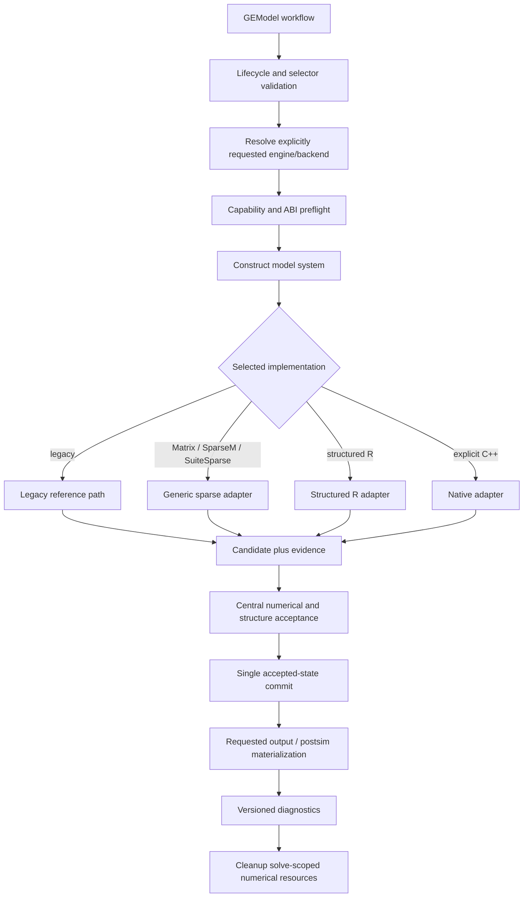

# Phase 4: Public API and Solver Boundaries - Research

**Researched:** 2026-09-29  
**Domain:** R package API design, R/native backend dispatch, generated R documentation  
**Confidence:** HIGH for repository contracts; MEDIUM for official tooling guidance

<user_constraints>
## User Constraints (from CONTEXT.md)

Source: [VERIFIED: .planning/phases/04-public-api-and-solver-boundaries/04-CONTEXT.md:6-48]

### Phase Boundary

DATA_c8af31d2_START
Replace the accidental broad namespace with a deliberate GEModelR facade and define one explicit internal contract for R and native solver backends. Document and test the supported exports, high-level runtime options, lifecycle boundaries, output selectors, diagnostics, and failure conditions without changing solver algorithms, numerical defaults, or the established GEModel workflow. Portability/CI, full release documentation, and publication remain later phases.
DATA_c8af31d2_END

### Locked Decisions

DATA_34d0f6a9_START
- **D-01:** Use a facade-first namespace centered on the `GEModel` reference-class entry point. Export only deliberate user-facing helpers if implementation proves one is needed; keep parser, compiler, solver, and native wrappers internal.
- **D-02:** Do not export low-level solver helpers or add a public capability probe in this phase. Users select backends through `GEModel$solveModel()` and inspect capabilities/results through documented model diagnostics.
- **D-03:** Stabilize only high-level `GEModelR.*` options: memory, tolerance, ordering, batching, and thread controls. Transaction/fault hooks and cache internals remain private.
- **D-04:** Apply a hard boundary to functions formerly reachable through `exportPattern()`: remove accidental exports without aliases or deprecation wrappers. The supported contract is the documented `GEModel` workflow.
- **D-05:** Retain stable explicit backend IDs, including the existing Matrix, SparseM, SuiteSparse, structured R, and explicit `StructuredSchurFGMRESCpp` paths. A requested backend is never silently replaced by another backend.
- **D-06:** Run capability and ABI preflight before matrix construction or mutable state changes. Missing native symbols, incompatible capabilities, and unavailable optional features fail closed with the requested backend, cause, and remediation.
- **D-07:** Allow validated structural sparsity/order metadata to persist on the model, but scope factors, RHS buffers, and numerical workspaces to one solve and release them on success or error.
- **D-08:** Require every backend to return a candidate plus structural metadata, finiteness/residual evidence, timing, and cleanup information. A central orchestrator owns acceptance, transaction boundaries, and state mutation.
- **D-09:** Make methods the supported mutation surface while preserving the established `variableValues`, closure, and shock workflows. Compiler, source-data, index, and cache fields are implementation state rather than supported direct mutation inputs.
- **D-10:** Setters use conservative invalidation. Closure changes invalidate structural/index/backend caches and accepted outputs; shock changes invalidate pending solve/post-simulation state and diagnostics while retaining compiled structures and source data.
- **D-11:** Keep engine selection coherent: `loadData(engine=...)` selects the runtime, `solveModel(engine=...)` must match it, and switching engines requires reloading data.
- **D-12:** Validate lifecycle order explicitly. Calls made before their prerequisites, and failures during loading or setup, report the next required action and preserve the prior model state.
- **D-13:** Validate `variables=` and `dimensions=` strictly for compact output. Unknown variables, dimensions, and oversized selections produce actionable errors; explicit empty selections retain their established behavior.
- **D-14:** Materialize labels and full model data on demand. Compact output reconstructs labels only for requested variables/dimensions; full output explicitly materializes the compatibility structure.
- **D-15:** Keep a small documented diagnostic envelope after every solve, with `diagnostics=TRUE` adding residual history, timings, allocations, capabilities, cleanup, and memory detail.
- **D-16:** Use stable GEModelR condition classes and a versioned diagnostic envelope so callers can distinguish validation, capability, numerical, post-simulation, retryable, and committed-state outcomes without parsing messages.
DATA_34d0f6a9_END

### the agent's Discretion

DATA_f381ab76_START
- Choose the exact explicit export list after auditing the compatibility manifest and generated documentation needs.
- Choose the internal registry/result-record shape, cache invalidation implementation, condition class names, and exact diagnostic field names while preserving the decisions above and Phase 2 numerical/state gates.
- Choose which high-level `GEModelR.*` keys are formally supported after inventorying existing options; private transaction and cache keys must remain unexported and undocumented.
DATA_f381ab76_END

### Deferred Ideas (OUT OF SCOPE)

DATA_a53d94e1_START
- Cross-platform native builds, OpenMP portability, and CI belong to Phase 5.
- Complete user/developer documentation, release qualification, and the final package license/release gates belong to Phase 6.
- Automatic backend selection, a new object system, and a standalone native solver package remain v2 architecture work.
- GitHub/R-universe publication belongs to Phase 7.
DATA_a53d94e1_END
</user_constraints>

<phase_requirements>
## Phase Requirements

| ID | Description | Research Support |
|----|-------------|------------------|
| API-01 | `GEModelR exports a deliberate documented public API instead of exportPattern("^[[:alpha:]]+").` [VERIFIED: .planning/REQUIREMENTS.md:32] | Explicit NAMESPACE allowlist, generated package/API help, and a namespace contract test. |
| API-02 | `Backend selection and capability checks use an explicit internal dispatch contract while preserving the R reference implementations.` [VERIFIED: .planning/REQUIREMENTS.md:33] | Private backend registry/adapters, early preflight, central candidate acceptance/commit, and backend reference tests. |
| DOCS-01 | `All supported exports, the package, and native/backend options have generated R documentation.` [VERIFIED: .planning/REQUIREMENTS.md:45] | Package topic plus generated reference-class and supported-option documentation checked with package docs. |
</phase_requirements>

## Summary

Plan this as one contract change across namespace, docs, and runtime dispatch. The live namespace still contains `exportPattern("^[[:alpha:]]+")` [VERIFIED: NAMESPACE:3], while the compatibility manifest marks `GEModel` as the supported documented entry point and many helper functions as internal [VERIFIED: inst/compatibility/GEModel-contract.csv:2-10]. Recommended public export set: `GEModel` only, unless the manifest/docs audit demonstrates a necessary user-facing helper. Keep generated docs and namespace tests synchronized; the current package Rd file is an export index whose aliases include internals and says narrowing is deferred [VERIFIED: man/GEModelR-package.Rd:1-8,38-45,173-184].

Use a private registry or equivalent adapter table behind `GEModel$solveModel()`. Preflight the requested adapter before model-matrix construction, have each adapter produce a candidate and evidence, run the existing structural/finiteness/true-residual authority centrally, then commit through the existing transaction seam. Preserve explicit backend identities and leave numerical kernels/defaults untouched [VERIFIED: R/GEModel.R:277-294; R/sparseSolver.R:1520-1621,2128-2180; R/zzzSparseSchurCpp.R:30-120,579-611].

The main plan risk is contract drift: current tests explicitly expect internal solver helpers to be exported and empty diagnostics after a successful solve, while D-01/D-04 and D-15 change both contracts. Update those assertions alongside tests for exact exports, options/docs, strict compact selectors, preflight ordering, cleanup, diagnostics envelope, and error classes. Preserve the existing numerical/state equivalence gates [VERIFIED: tests/testthat/test-public-solver-contract.R:1-44; .planning/phases/02-compatibility-and-numerical-baseline/02-CONTEXT.md].

**Primary recommendation:** Implement the facade and private backend contract first, then generate documentation and update contract tests against the resulting single supported surface. Use existing Matrix, structured R, native C++, and legacy paths as references; introduce no solver algorithm or default changes.

## Architectural Responsibility Map

| Capability | Primary Tier | Secondary Tier | Rationale |
|------------|-------------|----------------|-----------|
| User workflow and model lifecycle | `GEModel` facade | lifecycle/state helpers | `GEModel` owns load, closure, shock, solve, memory, serialization, and retry entry points [VERIFIED: R/GEModel.R:74-85,277-307; inst/compatibility/GEModel-contract.csv:198-208]. |
| Backend selection, preflight, candidate acceptance, and commit | Internal solver orchestrator | backend adapters | Current candidate gate already checks structure, finite values, and true residual before marking acceptance; current solve step constructs the main matrix before generic backend dispatch, so move backend preflight ahead of that boundary [VERIFIED: R/sparseSolver.R:1520-1621,2128-2180]. |
| Native capability and resource lifecycle | Private C++ adapter/runtime | generated Rcpp bindings | Native preflight checks registered routines, wrapper arity, capability payload, ABI, kernels, thread limits, and a deterministic Matrix comparison; factors are released with `on.exit` [VERIFIED: R/zzzSparseSchurCpp.R:30-120,510-514,579-607]. |
| Public API/reference documentation | R package documentation | NAMESPACE and testthat contracts | Roxygen2 generates NAMESPACE/Rd directives; package topic and reference-class fields/options can be documented without exposing implementation helpers [CITED: roxygen2 namespace and package-documentation guides]. |

### Flow to Preserve



The diagram reflects the locked sequencing and current transaction/native cleanup patterns; the named adapter/result fields are an implementation recommendation, not a frozen schema [VERIFIED: 04-CONTEXT.md:25-42; R/sparseSolver.R:1520-1621; R/zzzSparseSchurCpp.R:579-607].

## Standard Stack

### Core

| Component | Version in inspected environment | Purpose | Recommendation |
|---|---:|---|---|
| R | 4.3.0 | Package runtime and check/build toolchain | This is the installed development runtime; Phase 4 does not set a new minimum version. |
| Matrix | 1.6.3 | Generic sparse reference backend | Retain as sparse numerical authority. |
| Rcpp | 1.1.1.1.1 | Existing native bindings | Keep bindings private and generated. |
| SparseM | 1.81 | Explicit compatibility backend | Keep only under its existing explicit backend ID. |
| methods | 4.3.0 | `GEModel` reference-class facade | Preserve existing object system. |
| testthat | 3.3.2, edition 3 | Contract/regression tests | Extend current testthat suite; no framework migration. |
| roxygen2 | 7.3.3 installed locally | Generate NAMESPACE and Rd files | Use as a development-time generator; it is not currently in DESCRIPTION. |

The package metadata declares `Imports: Matrix, Rcpp, SparseM, methods`, `LinkingTo: Rcpp`, `Suggests: testthat`, and `Config/testthat/edition: 3` [VERIFIED: DESCRIPTION:21-30]. Versions above came from local `R`/`packageVersion()` probes on 2026-09-29; they are installed versions, not claims about latest releases. No new package is needed for this phase [VERIFIED: DESCRIPTION:21-30].

**Package legitimacy:** Not applicable; this phase adds no external package dependency or install.

### Documentation Guidance

Use the installed roxygen2 generator and commit generated artifacts. Official roxygen2 guidance maps `@export` tags to namespace exports, supports package-level documentation/options, and documents reference-class fields with `@field` [CITED: https://roxygen2.r-lib.org/articles/namespace.html; https://roxygen2.r-lib.org/articles/rd-packages.html; https://roxygen2.r-lib.org/reference/tags-rd-other.html]. Keep `DESCRIPTION` free of roxygen2 runtime dependency unless a later project decision requires generation during package installation.

## Architecture Patterns

### Pattern: One Private Backend Adapter Contract

**What:** Give each explicitly selected backend the same private lifecycle: validate request/capability, solve without mutating the model, return candidate plus structure/residual/timing/cleanup evidence, then let the orchestrator accept/reject and commit once. A backend’s preflight can be a no-op when no optional capability is required, but it must happen before the main system matrix or mutable state change. This follows D-06/D-08 and the existing `.sparse_accept_candidate()` and `.commit_accepted_state()` seams [VERIFIED: 04-CONTEXT.md:25-28; inst/compatibility/GEModel-contract.csv:226-229; R/sparseSolver.R:1520-1621].

**Backend IDs to keep explicit:** the compatibility manifest quotes these exact records: `"backend","Matrix","supported"`; `"backend","SparseM","compatibility-only"`; `"backend","StructuredSchur","supported"`; `"backend","StructuredSchurFGMRES","supported"`; `"backend","StructuredSchurFGMRESCpp","compatibility-only"`; `"backend","SuiteSparse","compatibility-only"` [VERIFIED: inst/compatibility/GEModel-contract.csv:209-214]. Do not collapse compatibility-only IDs, silently fall back, or advertise a public capability function.

**Rcpp boundary:** `R/RcppExports.R` declares itself generated by `Rcpp::compileAttributes()` and says not to edit by hand; `src/RcppExports.cpp` registers routines and disables dynamic symbols [VERIFIED: R/RcppExports.R:1-5; src/RcppExports.cpp:183-185]. If a native signature changes, regenerate those wrappers with Rcpp tooling rather than hand-editing generated files [CITED: https://www.rcpp.org/pdf/Rcpp-attributes.pdf]. Phase 4 should leave them unchanged if there is no native signature change.

### Pattern: Facade Contract Is Also the Documentation Contract

Treat the compatibility CSV, NAMESPACE, package topic, reference-class help, option docs, and namespace tests as one surface. The current manifest marks the `solveModel` formal/default contract and `loadData` engine choice; cite its exact signature row when documenting public calls [VERIFIED: inst/compatibility/GEModel-contract.csv:200-205]. R official docs support explicit exports and registered native routine boundaries; do not use broad name matching as the production API [CITED: https://cran.r-project.org/doc/manuals/r-release/R-exts.html; https://roxygen2.r-lib.org/articles/namespace.html].

**Recommended project structure:** retain focused implementation files in `R/`, package metadata in `NAMESPACE`/`DESCRIPTION`, generated API topics in `man/`, and contract tests under `tests/testthat/`. Do not add a new top-level runtime subsystem for the registry unless the current `R/` collation/order conventions require a separate file [VERIFIED: AGENTS.md; .planning/codebase/CONVENTIONS.md].

### Public Workflow Example

The source signature quotes `loadData(..., engine = c("legacy", "sparse"))` and the `solveModel` defaults `backend = "Matrix"`, `output = c("full", "compact")` [VERIFIED: R/GEModel.R:74-76,277-284]. Keep user examples on that facade:

```r
model <- GEModel$new()
model$loadTablo(tablo_path)
model$setClosure(exogenous_variables)
model$loadData(input_data, engine = "sparse")
model$setShocks(shocks)
model$solveModel(engine = "sparse", backend = "Matrix",
                 output = "compact", variables = requested_variables,
                 dimensions = requested_dimensions)
```

The public sequence is already covered by the documented-workflow test [VERIFIED: tests/testthat/test-documented-workflow.R:1-43].

### Anti-Patterns to Avoid

- Keep `exportPattern()` out of the final namespace; the live directive is broad [VERIFIED: NAMESPACE:3].
- Do not preserve accidental helpers through aliases or deprecation wrappers; this is explicitly decided [VERIFIED: 04-CONTEXT.md:18-21].
- Do not let each backend mutate `GEModel` or duplicate acceptance/commit rules; current phase 2 candidate and transaction seams are designed for a central gate [VERIFIED: inst/compatibility/GEModel-contract.csv:226-229].
- Do not expose native wrappers, cache internals, or fault injection as user API [VERIFIED: 04-CONTEXT.md:18-21,44-48; R/RcppExports.R:1-5].
- Do not silently intersect away unknown compact-output variable selections; current code does so and conflicts with strict validation [VERIFIED: R/sparseSolver.R:1986-1999; 04-CONTEXT.md:39].

## Option Inventory and Recommendation

Use a small documented allowlist plus option-bound tests. Preserve the memory-budget method/solve argument as the model-level control; document serialization size limits separately. Candidate keys below come from existing code and should be selected deliberately, not all exposed automatically:

| Category | Existing candidate | Current evidence | Planning recommendation |
|---|---|---|---|
| Memory | `memory_budget`; `GEModelR.serialization.max_bytes`; `GEModelR.serialization.max_elements` | `memory_budget` is a `solveModel` formal; serializer values appear in the exact source quotes below [VERIFIED: R/GEModel.R:277-284; R/modelSerialization.R:226-235]. | Document/test argument, method and serialized-payload limits; avoid inventing another global solver-memory option. |
| Ordering | `GEModelR.sparse.lu_order`; `GEModelR.sparse.suite_sparse_ordering` | Matrix and SuiteSparse option names/defaults/allowed values appear in the exact source quotes below [VERIFIED: R/sparseSolver.R:1431-1436; R/sparseSuiteSparse.R:19-40]. | Document only for explicitly supported backend(s), including allowed values and invalid-input behavior. |
| Tolerance | `GEModelR.sparse.structured_residual_tolerance`; `GEModelR.sparse.elimination_pivot_tolerance`; `GEModelR.sparse.schur_tolerance` | Solver option names/defaults appear in the exact source quotes below [VERIFIED: R/sparseSolver.R:2139-2144,2167-2175; R/sparseElimination.R:486-493]. | Do not change defaults; document meaning/scope and reject invalid values before state mutation. |
| Batching | `GEModelR.sparse.schur_region_batch_size`; `GEModelR.sparse.schur_panel_size`; related restart/iteration controls | Structured option names/defaults appear in the exact source quotes below [VERIFIED: R/sparseElimination.R:486-493]. | Document/test only controls that are intentionally supported for structured paths. |
| Threads | `GEModelR.sparse.schur_cpp_threads` | Current option name/default and capability checks appear in the exact source quotes below [VERIFIED: R/zzzSparseSchurCpp.R:110-120,313-320]. | Document threading limits, fail-closed behavior, and effective-thread diagnostics; portability remains Phase 5. |

Exact source values used in the inventory (verbatim):

```r
# R/modelSerialization.R:226-235
value = getOption("GEModelR.serialization.max_bytes", 256 * 1024^2)
value = getOption("GEModelR.serialization.max_elements", 50000000)

# R/sparseSolver.R:1431-1436
lu_order = getOption("GEModelR.sparse.lu_order", 3L)
stop("GEModelR.sparse.lu_order must be an integer from 0 to 3",

# R/sparseSolver.R:2142-2144,2170-2172
residual_tolerance = getOption(
  "GEModelR.sparse.structured_residual_tolerance", 2e-7
)
"GEModelR.sparse.elimination_pivot_tolerance", 1e-12

# R/sparseElimination.R:486-493
region_batch_size = getOption("GEModelR.sparse.schur_region_batch_size", 8L)
panel_size = getOption("GEModelR.sparse.schur_panel_size", 64L)
restart = getOption("GEModelR.sparse.schur_restart", 80L)
max_iterations = getOption("GEModelR.sparse.schur_max_iterations", 500L)
tolerance = getOption("GEModelR.sparse.schur_tolerance", 2e-7)

# R/zzzSparseSchurCpp.R:313-316
threads = suppressWarnings(as.integer(getOption(
  "GEModelR.sparse.schur_cpp_threads", 1L
))[1L])
```

The SuiteSparse option’s exact value table is `values = c(` followed by `cholmod = 0L, amd = 1L, given = 2L, metis = 3L, best = 4L, natural = 5L, none = 5L` [VERIFIED: R/sparseSuiteSparse.R:22-30]. Its validator’s error text is `"GEModelR.sparse.suite_sparse_ordering must be one of cholmod, amd, metis, best, natural"` [VERIFIED: R/sparseSuiteSparse.R:31-37].

Keep transaction/fault hooks and cache internals private per D-03; also review implementation-only vectorization/chunk/refinement controls rather than documenting them by namespace prefix alone [VERIFIED: 04-CONTEXT.md:20,48; R/GEModel.R:296-303; R/sparseSolver.R:1040-1044,1310; R/sparseSchurComplement.R:208-211,656-662].

## Don't Hand-Roll

| Problem | Don't Build | Use Instead | Why |
|---|---|---|---|
| Namespace and Rd generation | Manually maintain a broad alias list or hand-edit generated output | Explicit roxygen2 tags plus generated `NAMESPACE` and `man/` | Keeps exports and help topics in sync [CITED: roxygen2 namespace/package docs]. |
| Native wrapper registration | Hand-maintained `.Call` declarations | Rcpp Attributes generation and existing registered-routine pattern | Source marks Rcpp wrappers generated; R registration supports symbol checking and avoids dynamic symbol exposure [VERIFIED: R/RcppExports.R:1-5; src/RcppExports.cpp:183-185; CITED: https://cran.r-project.org/doc/manuals/r-release/R-exts.html; https://www.rcpp.org/pdf/Rcpp-attributes.pdf]. |
| Numerical correctness policy | Backend-specific acceptance and model writes | Existing central finiteness/structure/true-residual gate plus single commit seam | Prevents backend identity from weakening Phase 2 authority [VERIFIED: R/sparseSolver.R:1520-1621; inst/compatibility/GEModel-contract.csv:226-229]. |

### Alternatives Considered

The alternatives are constrained by locked decisions: do not retain broad helper exports with compatibility aliases, add a public backend capability probe, select a backend automatically, replace `GEModel` with a new object system, or change solver defaults in this phase [VERIFIED: 04-CONTEXT.md:18-28,44-48; .planning/REQUIREMENTS.md:52-63]. The useful implementation discretion is the internal registry/result record and the exact documented option allowlist.

## Runtime State Inventory

This is an API/dispatch refactor rather than a package identity rename; no persisted state migration is specified. Preserve the existing supported logical-state payload unchanged while changing in-memory API boundaries [VERIFIED: inst/compatibility/GEModel-contract.csv:207-208,216; 04-CONTEXT.md:32-42].

| Category | Items found | Action required |
|---|---|---|
| Stored data | The manifest row is `"serialization","gemodel-logical-state-v1","supported","plain-list"` [VERIFIED: inst/compatibility/GEModel-contract.csv:216]. | No schema migration planned; retain load/save behavior and add regression protection if internals move. |
| Live service config | None identified in the inspected package/API scope. [ASSUMED] | No service migration task; revisit only if implementation introduces an external integration. |
| OS-registered state | None identified; package has no service/task registration surface in this phase. [ASSUMED] | None. |
| Secrets/env vars | None identified in inspected API/backend configuration. [ASSUMED] | Keep user-provided model data/config outside fixtures and logs. |
| Build artifacts / installed packages | Rcpp wrapper sources are generated; native package builds may carry stale compiled outputs after source/signature changes [VERIFIED: R/RcppExports.R:1-5; src/RcppExports.cpp:183-185]. | Regenerate wrappers only for signature changes and rebuild the package before validation; do not commit generated object/DLL build output. |

## Common Pitfalls

### 1. Namespace narrowing breaks tests/help if done in isolation

The export test currently expects `solve_sparse_system` and `sparse_exact_schur_solve` in the namespace, while the same file verifies private `.GEModelR_` wrappers; update the test to assert the deliberate export allowlist and preserve wrapper privacy [VERIFIED: tests/testthat/test-public-solver-contract.R:39-44]. Remove stale aliases from the package Rd topic rather than leaving accidental helpers discoverable [VERIFIED: man/GEModelR-package.Rd:1-8,38-45,173-184].

### 2. Preflight can accidentally happen after expensive or mutable work

The generic one-step path emits the system matrix before choosing the backend implementation [VERIFIED: R/sparseSolver.R:2149-2163]. C++ already performs symbol/ABI/capability checks before delegating to the core solver [VERIFIED: R/zzzSparseSchurCpp.R:579-611]. Move selected-adapter preflight above system construction, preserving its requested ID and the current no-fallback error behavior.

### 3. Diagnostics decisions conflict with current assertions

The public-solver test freezes successful `lastDiagnostics` as `list()` when diagnostics are disabled [VERIFIED: tests/testthat/test-public-solver-contract.R:14-16]. Sparse solve currently stores a reduced envelope when disabled and more detail when enabled [VERIFIED: R/sparseSolver.R:2463-2513]. Replace stale success diagnostics at public solve entry with a version-1 running envelope and persist a terminal classed record on success and every normal validation, capability, numerical, postsimulation, or committed-state error exit. Verify attempt statuses, stable condition classes, accepted/retryable fields, and cleanup rather than parsing message strings [VERIFIED: 04-CONTEXT.md:41-42; Plan 04-05].

### 4. Output projection silently ignores misspelled variables

Current code uses `intersect(unique(variables), names(data))`, so unknown selections disappear rather than error; validate variable/dimension names and selection size before postsim materialization, while preserving explicit empty selection behavior [VERIFIED: R/sparseSolver.R:1986-1999; 04-CONTEXT.md:39-40].

### 5. Option docs can accidentally freeze implementation details

Options have mixed scope: user-facing controls coexist with private transaction hooks, cache state, and vectorization/chunk tuning [VERIFIED: R/GEModel.R:296-303; R/sparseSolver.R:1040-1044,1310; R/sparseSchurComplement.R:208-211,656-662]. Use the allowlist above and test documented names/defaults/validation rather than exposing every `GEModelR.*` setting.

### 6. Backend identity must remain observable

The manifest distinguishes supported and compatibility-only backend IDs [VERIFIED: inst/compatibility/GEModel-contract.csv:209-214]. The native wrapper routes an explicit C++ request through the shared structured R solve implementation while recording implementation metadata [VERIFIED: R/zzzSparseSchurCpp.R:608-620]. Keep requested backend, actual implementation, capability result, and cleanup outcome distinct in the diagnostics contract; do not silently substitute a different requested backend.

## Validation Architecture

`workflow.nyquist_validation` is enabled and `DESCRIPTION` configures testthat edition 3 [VERIFIED: .planning/config.json:15-19; DESCRIPTION:28-30]. Existing coverage includes public workflow, solver contract, transaction state, numerical baseline, native backend, and serialization; no Wave 0 framework installation is indicated [VERIFIED: tests/testthat.R:1-4; tests/testthat/test-public-solver-contract.R; tests/testthat/test-documented-workflow.R; tests/testthat/test-numerical-baseline.R; tests/testthat/test-transactional-state.R].

| Requirement | Behavior to verify | Test type | Existing / planned coverage |
|---|---|---|---|
| API-01 | Exact explicit export set; no broad export directive or internal aliases; public workflow remains callable | Namespace/package test + package check | Rewrite export expectations in `test-public-solver-contract.R`; add generated-alias assertions. |
| API-02 | Each explicit ID routes to correct adapter; capability failures happen pre-matrix/pre-mutation; accepted candidates preserve numerical/state gates; cleanup runs on success/error | Unit/integration with deterministic fixtures; native preflight can be injected | Extend solver contract/native tests and retain Phase 2 equivalence/residual fixtures. |
| DOCS-01 | Every public export, package topic, selected option and backend control has generated help | Rd/package check | Validate generated Rd aliases/options and run `R CMD check .`. |

Use `R CMD check .` as the package-level gate from repository guidance [VERIFIED: AGENTS.md]. Existing documented workflow tests should continue to cover the established call sequence; focused tests should assert empty and invalid selectors, engine mismatch/reload, diagnostics envelope/status, and resource cleanup. Do not rewrite numerical defaults or relax the numerical baseline.

## Security Domain

This is a local R package boundary with model-file inputs and caller-supplied selectors/options; there is no browser authentication/session surface. Apply OWASP ASVS 5.0.0 as a lightweight taxonomy, not a claim of ASVS compliance: V1 Encoding & Sanitization, V2 Validation & Business Logic, and V5 File Handling are relevant to parsing, logical-state loading, selector validation, and size limits; V6 Authentication, V7 Session Management, and V8 Authorization do not apply to the package API in scope [CITED: https://owasp.org/projects/asvs?tab=main; inference from package surface in R/GEModel.R and R/modelSerialization.R].

| Threat pattern | STRIDE | Standard mitigation for this phase |
|---|---|---|
| Invalid variable/dimension/backend/option values | Tampering | Strict allowlist and typed/range validation before solve state changes; structured conditions. |
| Oversized or malformed serialized model input | Denial of service / tampering | Preserve existing payload-size/element guards and validate complete logical-state schema before receiver mutation [VERIFIED: R/modelSerialization.R:226-240; inst/compatibility/GEModel-contract.csv:208]. |
| Native symbol/ABI mismatch or unsupported threading request | Tampering / denial of service | Fail closed during preflight with requested backend, cause, and remediation; keep resource cleanup in `on.exit` paths [VERIFIED: R/zzzSparseSchurCpp.R:30-120,579-607]. |

## State of the Art

| Old approach | Recommended current approach | Impact |
|---|---|---|
| Alphabetic `exportPattern()` | Explicit exports plus generated namespace docs | Public surface is auditable and internal implementation names stay internal [VERIFIED: NAMESPACE:3; CITED: https://cran.r-project.org/doc/manuals/r-release/R-exts.html; https://roxygen2.r-lib.org/articles/namespace.html]. |
| Backend-specific solve/commit paths | Explicit private adapters with central acceptance/commit | Preserves the same finiteness/residual/state gates across implementations [VERIFIED: 04-CONTEXT.md:25-28; inst/compatibility/GEModel-contract.csv:226-229]. |
| Hand-maintained native wrappers | Rcpp Attributes-generated bindings and registered symbols | Wrapper changes remain aligned with the C++ exports [VERIFIED: R/RcppExports.R:1-5; CITED: https://www.rcpp.org/pdf/Rcpp-attributes.pdf]. |

## Assumptions Log

| # | Claim | Section | Risk if wrong |
|---|---|---|---|
| A1 | The public export allowlist can be only `GEModel`; the compatibility manifest lists no other supported export. | Summary | A currently undocumented but relied-upon helper might be excluded; resolve by manifest/docs audit before locking the plan. |
| A2 | No live service config, OS registration, or secret/env migration is needed for this package API refactor. | Runtime State Inventory | An out-of-repository workflow may depend on undocumented internal exports or options. |
| A3 | Serialization limit options are sufficient as the documented global memory-related options; solver budget remains a method/argument rather than a new global option. | Option Inventory | Users may expect a global solver memory setting; the phase planner should align option allowlist with D-03 and current API. |

## Resolved Decisions

These two research questions were resolved in plans 04-05 and 04-06. The selector decision remains unchanged: runtime `engine` and explicit solver `backend` are separate nouns and selectors per D-05/D-11.

1. **Supported option allowlist — resolved per 04-06.** Document exactly the following existing high-level options: `GEModelR.sparse.lu_order` (integer 0–3, default `3`); `GEModelR.sparse.suite_sparse_ordering` (default `amd`, accepts `cholmod`, `amd`, `metis`, `best`, `natural`, and `none`; `given` is rejected by the validator); `GEModelR.sparse.structured_residual_tolerance` (`2e-7`); `GEModelR.sparse.elimination_pivot_tolerance` (`1e-12`); `GEModelR.sparse.schur_region_batch_size` (`8`); `GEModelR.sparse.schur_panel_size` (`64`); `GEModelR.sparse.schur_restart` (`80`); `GEModelR.sparse.schur_max_iterations` (`500`); `GEModelR.sparse.schur_tolerance` (`2e-7`); `GEModelR.sparse.schur_cpp_threads` (`1`); `GEModelR.serialization.max_bytes` (`268435456`); and `GEModelR.serialization.max_elements` (`50000000`). Document SuiteSparse ordering because its explicit backend ID and option remain supported, although the backend is compatibility-only. The existing `memory_budget` argument/setter is the memory control; add no global memory option. Keep transaction/fault hooks, caches, and implementation-only vectorization/chunk/refinement controls private. These are the complete supported docs list per D-03 and the Plan 04-06 option contract [VERIFIED: 04-CONTEXT.md:20,46-48; inst/compatibility/GEModel-contract.csv:209-214; Plan 04-06].

2. **Version-1 per-attempt diagnostics — resolved per 04-05.** Persist the envelope in `GEModel$lastDiagnostics`. Its always-present fields are `schema_version` (`1L`), `engine`, `requested_backend`, `implementation`, `status`, `condition_class`, `accepted_numerical_state`, `retryable_postsim`, `failure_phase`, `failure_reason`, and `cleanup_status`. The stable statuses are `running`, `succeeded`, `validation_failed`, `capability_failed`, `numerical_failed`, `postsim_failed`, and `committed_state_failed`. Set `running` before public solve argument/selector validation or dispatch, then persist the terminal success or classed normal-error outcome before return/rethrow so a failed attempt cannot leave stale success diagnostics. Preserve requested selector values even if invalid; `implementation` and `condition_class` are null until known. D-16 primary error classes are `GEModelR_validation_error`, `GEModelR_capability_error`, `GEModelR_numerical_error`, `GEModelR_postsim_error`, `GEModelR_retryable_postsim_error`, and `GEModelR_committed_state_error`; lifecycle validation uses the same exact primary validation class. `diagnostics=TRUE` adds residual history, timings, allocations, capability evidence, detailed cleanup, and memory evidence. This names ordinary success/error outcomes; the separate specless concurrency/interruption probe remains flagged unresolved and receives no new guarantee. These names and states are the contract selected by Plan 04-05 [VERIFIED: 04-CONTEXT.md:41-42; Plan 04-03; Plan 04-05].

## Project Constraints (from AGENTS.md)

- Keep implementation in focused `R/` files; `GEModel` remains the reference-class facade in `R/GEModel.R`. [VERIFIED: AGENTS.md; R/GEModel.R:7-12]
- Preserve the established `GEModel$new()`, `loadTablo()`, `loadData()`, closure/shock, `solveModel()` workflow. [VERIFIED: AGENTS.md; tests/testthat/test-documented-workflow.R:1-43]
- Match nearby base-R style: two-space indentation, `=` assignment, camelCase functions/methods, PascalCase class-like objects; avoid unrelated formatting. [VERIFIED: AGENTS.md]
- Keep tests deterministic and small under `tests/testthat/`; do not add proprietary or oversized TABLO/HAR fixtures. [VERIFIED: AGENTS.md]
- Do not commit `.RData`, `.Rhistory`, `.Rproj.user/`, build archives, `*.Rcheck/`, credentials, private model inputs, or generated solver results. [VERIFIED: AGENTS.md]
- Package-level validation commands are `R CMD check .`, `R CMD build .`, and `R CMD INSTALL .`; use `R CMD check .` as the acceptance gate. [VERIFIED: AGENTS.md]
- Follow imported RTK command-prefix instruction for shell commands. [VERIFIED: AGENTS.md; /home/zenz/.codex/RTK.md]

## Environment Availability

| Dependency | Required by | Available | Version | Fallback |
|---|---|---:|---|---|
| R | Package generation/checks | Yes | 4.3.0 | — |
| Matrix, Rcpp, SparseM, methods | Existing sparse/native package code | Yes | 1.6.3 / 1.1.1.1.1 / 1.81 / 4.3.0 | None needed in inspected environment |
| testthat | Regression tests | Yes | 3.3.2 | — |
| roxygen2 | Generate NAMESPACE/Rd | Yes | 7.3.3 | Manual generated-output review only if unavailable |

Versions are local probes from 2026-09-29. No additional external tool/service dependency was identified; no package install is proposed [VERIFIED: DESCRIPTION:21-30; local `R` and `packageVersion()` probes].

## Sources

### Primary repository sources

- `.planning/phases/04-public-api-and-solver-boundaries/04-CONTEXT.md` — locked decisions, scope, and discretion lines cited throughout.
- `.planning/REQUIREMENTS.md` — API-01, API-02, DOCS-01 and phase mapping.
- `inst/compatibility/GEModel-contract.csv` — supported exports/method signatures/backend IDs and transaction seams.
- `NAMESPACE`, `DESCRIPTION`, `R/GEModel.R`, `R/sparseSolver.R`, `R/zzzSparseSchurCpp.R`, `R/RcppExports.R`, `src/RcppExports.cpp` — implementation seams cited above.
- `tests/testthat/test-public-solver-contract.R`, `tests/testthat/test-documented-workflow.R` — current contract and workflow assertions.

### Official documentation

- R Core Team, *Writing R Extensions*, namespace and registered native routine sections: https://cran.r-project.org/doc/manuals/r-release/R-exts.html
- roxygen2, namespace generation: https://roxygen2.r-lib.org/articles/namespace.html
- roxygen2, package-level documentation: https://roxygen2.r-lib.org/articles/rd-packages.html
- roxygen2, Rd tags including reference-class fields: https://roxygen2.r-lib.org/reference/tags-rd-other.html
- Rcpp Attributes: https://www.rcpp.org/pdf/Rcpp-attributes.pdf
- R Reference Classes: https://stat.ethz.ch/R-manual/R-devel/library/methods/html/ReferenceClasses.html
- OWASP Application Security Verification Standard 5.0: https://owasp.org/projects/asvs?tab=main

## Metadata

**Confidence breakdown:**
- Standard stack: HIGH — project metadata and installed versions directly inspected.
- Architecture: HIGH — current source and tests identify the relevant seams; adapter shape remains a recommendation.
- Pitfalls: HIGH — each listed conflict is directly represented by source and locked decisions.
- External documentation guidance: MEDIUM — official documentation was checked through web search fallback because Context7 was unavailable.

**Research date:** 2026-09-29  
**Valid until:** 2026-10-29 for the stable in-repo architecture; recheck roxygen/Rcpp tool documentation before future dependency upgrades.
