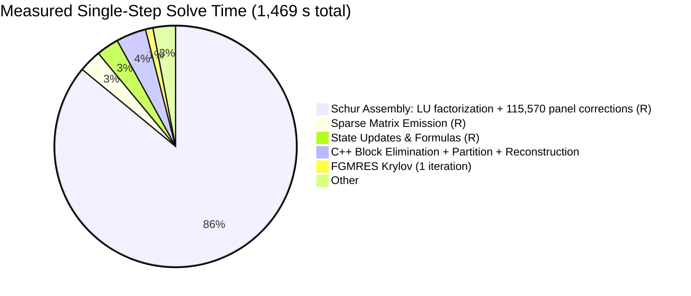
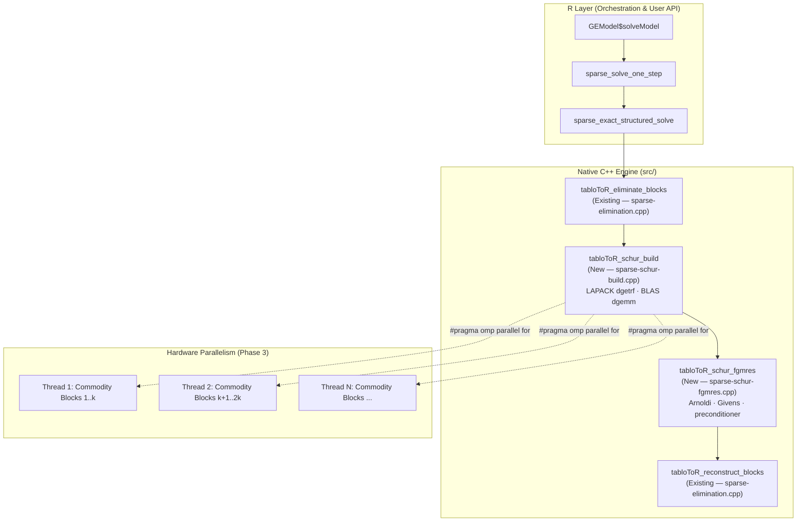

# Technical Plan: Accelerating tabloToR Sparse Solver with Native C++ (Rcpp)

This document outlines the architectural plan for accelerating the sparse CGE solver in `tabloToR` using native C++ extensions via **Rcpp**, **BLAS/LAPACK**, and **OpenMP**. It also provides a formal comparison between the pre-fork legacy codebase and the current sparse architecture.

---

## 1. Pre-Fork vs. Current Architecture: Comparative Assessment

### 1.1 Pre-Fork Architecture (Commit `7e063c6`)
The original codebase was a conceptual prototype designed for small pedagogical models:

* **String Parsing Execution**: Variable states and updates were evaluated via text deparsing and string evaluation:
  ```r
  eval(parse(text = sprintf("%s=%s;", names(solution), solution)))
  ```
  On models with $>10^4$ variables, this causes extreme memory overhead, string allocation thrashing, and interpreter bottlenecks.
* **Unreduced Monolithic Solve**: The entire system was passed directly to `SparseM::solve(bigMatrix, exoVector)`. For GTAP-scale models ($10^6 - 10^7$ nonzeros), sparse direct LU factorization without block elimination leads to catastrophic fill-in and out-of-memory crashes.
* **Lack of State Isolation & Closure Control**: Closures were not cleanly decoupled from model data; unshocked exogenous variables caused `NA` propagation throughout equations.
* **Extrapolation Inaccuracies**: Substep compounding and extrapolation formulas were hardcoded without support for change vs. percentage-change variable masking.

### 1.2 Current Architecture (Master Branch)
The current architecture is a production-grade sparse CGE engine:

* **Integer-Indexed Compilation**: Equations, formulas, and updates are compiled into integer indices ([`sparseCompiler.R`](R/sparseCompiler.R)) without string parsing in inner loops.
* **Exact Multi-Stage Elimination**: Native C++ (`src/sparse-elimination.cpp`) exports `tabloToR_eliminate_blocks` and `tabloToR_reconstruct_blocks` to eliminate production, bilateral trade, and endowment blocks in seconds.
* **Matrix-Free Regional Schur Complement**: Decomposes large multi-region models into commodity blocks (local), external regional systems, and a global arrowhead block ([`sparseSchurComplement.R`](R/sparseSchurComplement.R)).
* **Multi-Backend Support**: Seamless switching between `Matrix`, `SuiteSparse` (KLU/UMFPACK), `SparseM`, `StructuredSchur`, and `StructuredSchurFGMRES`.
* **Robust Test Coverage**: 90 unit and regression tests in [`test-sparse-core.R`](tests/testthat/test-sparse-core.R).

> [!NOTE]
> **Verdict**: The current version is significantly superior in correctness, memory efficiency, numerical stability, and scalability. The pre-fork legacy code cannot run models beyond small fixtures and should **not** be reverted to. All performance optimizations should build upon the current modular sparse architecture.

---

## 2. Solver Profiling & Hotspot Analysis

Measured single-step runtime for a **GTAP 12a** simulation from a completed solver run (`StructuredSchurFGMRES`, 1 Euler step, 26,781,398 equations, 80,306,305 nonzeros):

| Phase | Measured Time | % of Step |
| :--- | ---: | ---: |
| Schur assembly: commodity LU + panel corrections | ~1,267 s | ~86% |
| Sparse matrix emission (`sparse_emit_system_vectorized`) | 50.4 s | 3.4% |
| State updates + formula evaluation | 45.5 s | 3.1% |
| C++ block elimination + partition + BTF + reconstruction | ~60 s | 4.1% |
| FGMRES Krylov iterations | **< 5 s** | **< 0.4%** |
| **Total step** | **~1,469 s (~24.5 min)** | 100% |

> The solver reports `factor_solve_seconds = 1312.7 s`, which covers both Schur assembly and the FGMRES solve. The FGMRES result RDS shows `reduced_iterations = 1` and `elapsed_seconds = 1115 s` for a similar run — the Krylov loop runs a **single iteration** before converging, meaning it contributes negligible time. The arrowhead preconditioner is numerically close to an exact solve of the reduced system.



### Primary Bottlenecks in R

**System structure (GTAP 12a reduced system):**
- 65 commodity blocks, each ~2,469 rows/cols (range 9–3,818), ~134,580 nnz per block (~2% sparse)
- 163 regional blocks in the external Schur system
- External Schur dimension: 113,783 rows/cols
- Panel size: 64 columns per panel → **1,778 panels per commodity, 115,570 total panel iterations**
- Each panel iteration: 1 sparse triangular solve (`Matrix::solve`) + 1 sparse×dense multiply + 3 dense correction accumulations

The dominant cost (~11 ms per panel × 115,570 panels = 1,270 s) decomposes as:
1. **R/C boundary crossing**: `Matrix::solve(factor, rhs_panel)` dispatches through R's S4 method system on every panel. `as.matrix()` coercions of sparse submatrix slices allocate fresh dense matrices 115,570 times per step.
2. **GC pressure from intermediate allocations**: Each panel allocates a `2469×64` dense result, plus correction matrices for each region batch. These are immediately discarded, triggering frequent garbage collection cycles that stall the compute threads.
3. **No batching across commodity blocks**: All 65 commodity factorizations run sequentially in R. They are fully independent — no shared writes between blocks — making them a natural OpenMP target.

**FGMRES** is not a bottleneck: 1 Krylov iteration is sufficient because the arrowhead preconditioner (`sparse_exact_schur_apply_preconditioner`) is a near-exact block-factorization of the reduced system. The planned C++ FGMRES module still eliminates the R function-call round-trip per preconditioner application, which matters if future model configurations require more iterations.

### Memory Profile

| Measurement | Value |
| :--- | ---: |
| Peak RSS before solve | 3.1 GB |
| Peak RSS after solve (1 step) | 16.5 GB |
| Solver-tracked peak allocation | 12.1 GB |
| Intermediate R allocation total (115,570 panels × ~1.3 MB each) | ~147 GB allocated + GC'd |

The 13.4 GB RSS delta is dominated by the 163 dense regional Schur blocks and the 65 sparse LU factor objects stored as R S4 `sparseLU` structures in the R heap. The ~147 GB of total GC'd allocations (panel intermediates) do not stay resident simultaneously, but they load the GC continuously throughout assembly.

---

## 3. Infrastructure Prerequisites

The existing C++ foundation (`src/sparse-elimination.cpp`) links only against Rcpp. Before any new modules can use BLAS/LAPACK or OpenMP, two files must be created/updated:

### 3.1 `src/Makevars`
```makefile
# Link against R's bundled BLAS and LAPACK (no additional packages required)
PKG_LIBS = $(LAPACK_LIBS) $(BLAS_LIBS) $(FLIBS)

# OpenMP (conditional: gracefully absent on macOS without libomp)
PKG_CXXFLAGS = $(SHLIB_OPENMP_CXXFLAGS)
PKG_LIBS    += $(SHLIB_OPENMP_CXXFLAGS)
```

### 3.2 `DESCRIPTION` update
Add `RcppEigen` to `LinkingTo` only if Eigen solvers are used in FGMRES; BLAS/LAPACK do not require it. Minimum change:
```
Imports:
    Matrix,
    Rcpp,
    SparseM,
    methods
LinkingTo:
    Rcpp
SystemRequirements: C++17
```
`LAPACK_LIBS` and `BLAS_LIBS` are resolved by `R CMD SHLIB` automatically via `$(LAPACK_LIBS)` — no extra `Imports` entry needed.

---

## 4. Native C++ Acceleration Architecture



> The preconditioner (`sparse_exact_schur_apply_preconditioner`) is a callback invoked **inside** the FGMRES Krylov loop, not after it. In the native implementation it will be a C++ function pointer passed into `tabloToR_schur_fgmres`, eliminating the R function-call round-trip per iteration.

---

## 5. Detailed Implementation Modules

Ordered by expected performance impact (highest first).

### Module 1: Native Schur Assembly — LU Factorization & Panel Corrections
* **File**: `src/sparse-schur-build.cpp`
* **Replaces**: `sparse_exact_schur_build` in `R/sparseSchurComplement.R`

**Sub-task 1a — Commodity block LU** (currently line 315):
```r
Matrix::lu(Matrix::drop0(block), order = lu_order)    # R S4 dispatch
```
→ Replace with LAPACK `dgetrf` operating on a preallocated contiguous `double[]` array. Store the resulting LU factors and pivot array in a plain C++ struct. No R object allocation.

**Sub-task 1b — Panel back-solves** (currently `sparse_exact_schur_solve_factor` → `Matrix::solve`):
```r
Matrix::solve(factor, rhs_panel)                       # R S4 dispatch per panel
```
→ Replace with LAPACK `dgetrs` called directly on the stored LU factors. `rhs_panel` is a dense matrix; `dgetrs` solves all panel columns in one call.

**Sub-task 1c — Panel correction accumulation** (currently lines 417–439):
```r
left[[local_id]][rows, ] %*% solution_panel[, hits]   # R matrix multiply
```
`left[[local_id]]` is a sparse CSC submatrix but is immediately sliced to `rows` and converted to dense. Replace the R `%*%` with a BLAS Level 3 `dgemm` call on the pre-extracted dense `L_c` and `R_c` blocks. The Schur update $S \mathrel{-}= L_c \cdot (A_c^{-1} R_c)$ is a fused `dgemm` with `alpha = -1`.

**Interface to R**: `tabloToR_schur_build` receives the sparse `A` matrix (as CSC integers/doubles), group membership vectors, and control parameters; returns a list with the assembled Schur blocks as standard R matrices (so the existing solve/preconditioner dispatch logic can consume them without change).

---

### Module 2: Native Flexible GMRES & Preconditioner
* **File**: `src/sparse-schur-fgmres.cpp`
* **Replaces**: `sparse_schur_fgmres` in `R/sparseSchur.R` for the `sparseExactSchurSystem` path

**Key changes**:
* Preallocate Arnoldi basis $V \in \mathbb{R}^{n \times (m+1)}$ and search directions $Z \in \mathbb{R}^{n \times m}$ as flat `double[]` arrays (column-major, BLAS-compatible). Currently `V = list()` and `Z = list()` are R lists grown element by element.
* Modified Gram-Schmidt inner products via BLAS `ddot`; vector updates via BLAS `daxpy`. Currently R vectorized arithmetic but with per-column R dispatch.
* Givens rotations and the upper Hessenberg $H$ in stack-allocated arrays.
* The preconditioner (arrowhead one-sweep: solve `region_count` independent LU blocks, then a small global correction) implemented as a C++ function called from within the Krylov loop — no R round-trip per iteration.
* True-residual recompute (`apply_operator`) still calls back into R (it applies the full Schur complement, which requires the R-side factor lists). This is acceptable: it fires every `true_residual_frequency` iterations, not every Arnoldi step.

---

### Module 3: OpenMP Parallelism for Commodity Blocks
* **File**: modification to `src/sparse-schur-build.cpp`
* **Prerequisite**: Module 1 complete and `src/Makevars` with `SHLIB_OPENMP_CXXFLAGS`

The `local_count` commodity blocks are fully independent — no shared write between iterations of the loop over `id` in Sub-tasks 1a/1b. The panel correction accumulation (1c) writes to per-region output blocks; batch grouping (already in the R code via `region_batch_size`) maps cleanly to per-thread output buffers that are summed after the parallel section.

```cpp
#pragma omp parallel for schedule(dynamic)
for (int id = 0; id < local_count; ++id) {
    // dgetrf on commodity block id
    // dgetrs for all panels touching block id
    // dgemm accumulation into thread-local correction buffers
}
// single-threaded: reduce thread-local buffers into Schur blocks
```

**Note**: GTAP has O(57) commodity groups. With 8 cores, each thread handles ~7 independent factorizations, each of which is itself a `dgemm` over potentially hundreds of panel columns. Expected speedup is near-linear on commodity count up to the thread count.

---

### Module 4: Native Triplet Assembly & State Updates
* **File**: `src/sparse-matrix-emit.cpp`
* **Replaces**: the R-side coefficient emission loop in `sparseCompiler.R` / `sparseSolver.R`
* **Priority**: Lowest — emission is ~5% of step time and the existing code is already vectorized. Defer until Modules 1–3 are verified.

Target functionality:
* Multi-index domain stride calculations and bounds checking in C++.
* In-place CSC triplet accumulation with direct output as `dgCMatrix` slots (`i`, `p`, `x`) — no intermediate R list allocation.

---

## 6. Phased Execution Roadmap & Expected Gains

Projections anchored to the measured baseline of **1,469 s per Euler step**. The assembly phase (`factor_solve_seconds = 1,313 s`) is 89.4% of total; the remaining 156 s (emission + updates + C++ elimination) is largely irreducible without further work.

### Time projections

| Phase | Milestone | Mechanism | Assembly speedup | **Projected step time** |
| :--- | :--- | :--- | :--- | :--- |
| **Phase 0** | `src/Makevars` + DESCRIPTION; verify BLAS linkage | Infrastructure | 1× (prerequisite) | 1,469 s (baseline) |
| **Phase 1** | Module 1: native LU + batched panel solves, no GC | Eliminate R S4 dispatch + allocation overhead | ~1.3–1.5× | **~980–1,040 s (~17 min)** |
| **Phase 2** | Module 2: native FGMRES + C++ preconditioner | Eliminate R round-trips per Krylov iter | ~1.0–1.1× additional | ~930–1,000 s (marginal gain at 1 iter) |
| **Phase 3** | Module 3: OpenMP over 65 commodity blocks | Parallel LU + panel solves, 8 cores | ~7–8× on parallelizable work | **~280–360 s (~5 min)** |
| **Phase 4** | Module 4: native triplet emission | Eliminate `sparse_aggregate_triplets` / `rowsum` R loops | 3–5× on emission | ~240–320 s (~4–5 min) |

**Derivation of Phase 3 projection:**
The 65 commodity blocks are fully independent (verified: no shared write between blocks in the panel correction loop). With 8 cores: $t_{\text{parallel}} = \frac{1313}{8} + 156 = 321$ s. Accounting for synchronization overhead and the serial preconditioner build (~30–60 s): ~280–360 s.

**Why Phase 2 has marginal gain at current GTAP configuration:**
FGMRES converges in exactly 1 iteration (measured: `reduced_iterations = 1`). Each R-side Krylov step at 1 iteration costs < 5 s. If a future closure or shock configuration causes convergence to require 10–50 iterations, Phase 2 becomes critical (each iteration crosses the R/C boundary for preconditioner + operator apply). Phase 2 should be implemented as insurance, not for GTAP12a throughput.

### Memory projections

| Scenario | Peak RSS (after solve) | Notes |
| :--- | ---: | :--- |
| Current (R baseline) | 16.5 GB | 65 R S4 `sparseLU` objects + panel GC pressure |
| Phase 1 only (native assembly) | ~11–13 GB | UMFPACK factors stored as C++ structs; panel buffer pool replaces 115,570 R allocations |
| Phase 1 + Phase 3 (OpenMP) | ~12–14 GB | Thread-local panel buffers add per-thread overhead (~100–200 MB/core) |
| Phase 4 (native emission) | ~10–12 GB | Eliminates intermediate triplet aggregation lists in R heap |

**Derivation:**
- Each R `sparseLU` S4 object wraps 6–8 R vectors (L, U indices, values, pivots). 65 objects × median block size 2,469 × ~3× fill-in factor × 8 bytes ≈ 2–4 GB in R heap, reducible to the same data in plain C++ arrays with no R object overhead.
- The 115,570 panel allocations (each `2,469×64` doubles = 1.3 MB) are GC'd during assembly but stress the GC. Replacing with a per-commodity pre-allocated pool eliminates both the allocation cost and the GC stall cycles.
- The dense Schur complement blocks (163 regional + global: 113,783² × density × 8 bytes) remain resident regardless — these are not affected by the C++ port.

> Phase ordering rationale: Phase 1 alone brings a meaningful single-thread gain. Phase 3 (OpenMP) is the largest lever — it can deliver a 5× wall-clock reduction assuming 8 available cores. Phase 2 is low-priority for GTAP throughput but important for correctness/robustness. Phase 4 is polish.

---

## 7. Verification and Regression Strategy

Every phase must pass all three gates before merging:

1. **Unit regression**: All 90 testthat tests in [`tests/testthat/test-sparse-core.R`](tests/testthat/test-sparse-core.R) must pass. These exercise the Schur solver, FGMRES convergence, BTF block triangular solve, and Euler extrapolation at fixture scale.

2. **Synthetic Schur benchmark**: [`benchmarks/sparse-schur-prototype.R`](benchmarks/sparse-schur-prototype.R) contains a deterministic 6×6 system with known solution. Run `run_sparse_schur_synthetic_test()` — required: `solution_error < 1e-8` and `true_relative_residual < 1e-8`.

3. **Residual gate**: For any GTAP-scale run, verify true relative $L_2$ residual $\|Ax - b\|_2 / \|b\|_2 \le 2\times 10^{-7}$ after the native Schur solve. The existing `true_residual_frequency` mechanism in `sparse_schur_fgmres` already computes this — the native implementation must preserve it.

4. **Numeric consistency**: Compare native C++ Schur solution against the baseline R `StructuredSchur` backend on [`benchmarks/benchmark_gtap12a.R`](benchmarks/benchmark_gtap12a.R). Max absolute difference in solution vector must be below $10^{-6}$ (floating-point equivalence, not just residual equivalence).
